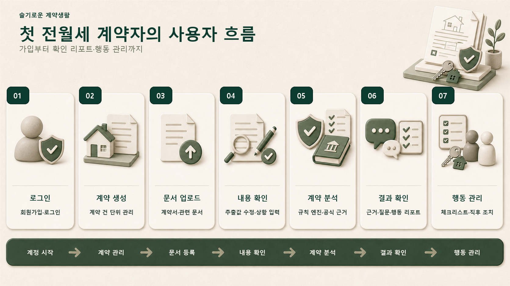
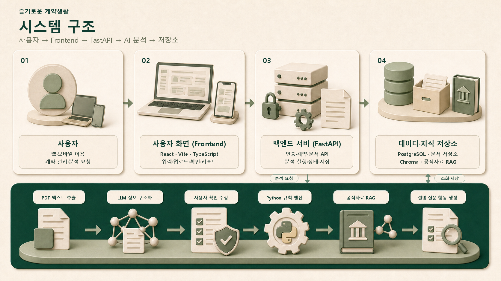

# 슬기로운 계약생활

> 첫 전월세 계약을 준비하는 청년을 위한 계약 확인 도우미

계약서와 관련 문서를 함께 확인하고, 사용자가 **무엇을 확인하고·무엇을 묻고·어떤 기록을 남겨야 하는지** 근거와 함께 안내하는 회원 기반 모바일 웹앱입니다.

> [!IMPORTANT]
> 계약의 안전성·전세사기·적법성을 단정하지 않습니다. 확인 항목, 질문, 체크리스트, 증빙 행동을 제공합니다.

## 핵심 기능

- 계약 건 생성과 계약 문서 관리
- PDF·이미지 문서 추출과 사용자 확인·수정
- Python 규칙 엔진 기반 문서 내부 판정·교차검증
- 공식 법령·공공자료 RAG 기반 근거 검색
- 확인 질문·수정 요청 문구·체크리스트·계약 직후 행동 안내
- 분석 결과 저장·재조회와 계약 연습 시뮬레이션

## 사용자 흐름

<p align="center">
  
</p>

AI 추출값과 계약 상황은 분석 전에 사용자가 확인·수정합니다. 분석 결과와 체크리스트는 계약 건 단위로 저장합니다.

상세: [사용자 흐름](docs/planning/user-flow.md)

## 동작 구조

<p align="center">
  
</p>

책임 경계:

- **Gemini 3.5 Flash**: 문서 구조화와 설명·질문·행동 생성
- **Python 규칙 엔진**: 판정 상태와 시급도 결정
- **RAG**: 공식 근거 검색. 판정 변경 금지
- **로컬 7B**: 선택적 성능 비교 실험. MVP 크리티컬 패스 제외

상세: [시스템 아키텍처](docs/architecture/system-architecture.md)

## 기술 스택

| 영역 | 기술 |
|---|---|
| Frontend | React · Vite · TypeScript |
| Backend | Python · FastAPI |
| DB / 검색 | PostgreSQL · Chroma · BM25 |
| AI | Gemini 3.5 Flash · gemini-embedding-001 · Cohere rerank-v4.0-pro |
| 문서 처리 | PyMuPDF · PDF.js · Gemini VLM |
| 통합 스키마 | Pydantic (`ai/src/lease_companion_ai/schemas/`) |

## 빠른 실행

필수 환경: Python 3.10, Node.js 20.19+ 또는 22.12+, npm, Docker Desktop.

### 1. 최초 설치

```powershell
py -3.10 -m venv .venv
.\.venv\Scripts\Activate.ps1
python -m pip install --upgrade pip
python -m pip install -e .\ai -e .\backend
Copy-Item backend\.env.example backend\.env

cd frontend
npm install
cd ..
```

### 2. 전체 MVP 실행

Docker Desktop을 실행한 뒤 저장소 루트에서 실행합니다.

```powershell
powershell -ExecutionPolicy Bypass -File .\scripts\start-dev.ps1 -RealContractValidation
```

- Frontend: `http://127.0.0.1:5173`
- Backend health: `http://127.0.0.1:8301/health`
- API 문서: `http://127.0.0.1:8301/docs`
- 종료: 실행 터미널에서 `Ctrl+C`

Gemini·Cohere 실호출은 선택입니다. `backend/.env`에 `GEMINI_API_KEY`, `COHERE_API_KEY`를 설정합니다. 키가 없으면 지원되는 로컬 fallback을 사용하며, 스캔·사진 OCR에는 `GEMINI_API_KEY`가 필요합니다.

상세 검증 절차: [실전 계약 점검 runbook](docs/testing/real-contract-validation.md)

### DB 없는 최소 데모

```powershell
.\.venv\Scripts\Activate.ps1
python -m pip install -r requirements-minimum-mvp.txt
.\scripts\run-minimum-mvp.ps1
```

정식 React Frontend와 PostgreSQL 저장은 포함하지 않습니다.

상세: [최소 MVP runbook](docs/planning/minimum-mvp-runbook.md)

## 현재 상태

| 구분 | 상태 |
|---|---|
| 실전 계약 점검 | Backend·Frontend 연결 완료 |
| 계약 연습 | 텍스트 평가·복기와 선택적 로컬 미디어 연결 완료 |
| 로컬 fallback | FastAPI·PostgreSQL 흐름 검증 기록 있음 |
| 추가 검증 필요 | 실제 Gemini·Cohere 품질·비용, 독립 평가셋 검토 |
| 후속 범위 | R20~R22 외부 데이터 자동 연결, 운영 배포·보안 정책 |

운영 배포 플랫폼은 아직 확정하지 않았습니다.

## 프로젝트 구조

| 경로 | 책임 |
|---|---|
| [`frontend/`](frontend/README.md) | 모바일 웹 UI |
| [`backend/`](backend/README.md) | API·오케스트레이션·저장 |
| [`ai/`](ai/README.md) | 문서 처리·구조화·규칙·RAG·생성·평가 |
| [`data/`](data/README.md) | 합성 샘플·규칙·RAG·평가 데이터 |
| [`docs/`](docs/README.md) | 기획·설계·결정 기록·테스트 문서 |

## 데이터 원칙

실제 계약서·개인정보·모델 가중치·체크포인트를 Git에 커밋하지 않습니다. 샘플과 평가 데이터는 가상 또는 완전 비식별 자료만 사용합니다.

상세: [개인정보 보호 원칙](docs/data/privacy-policy.md)

## 주요 문서

- [MVP 범위](docs/planning/mvp-scope.md)
- [판정 명세](docs/data/judgment-spec.md)
- [AI 파이프라인](docs/architecture/ai-pipeline.md)
- [계약 연습 작업 가이드](docs/planning/practice-simulation-work-guide.md)
- [계약 연습 API 검증](docs/testing/practice-real-api-validation.md)
