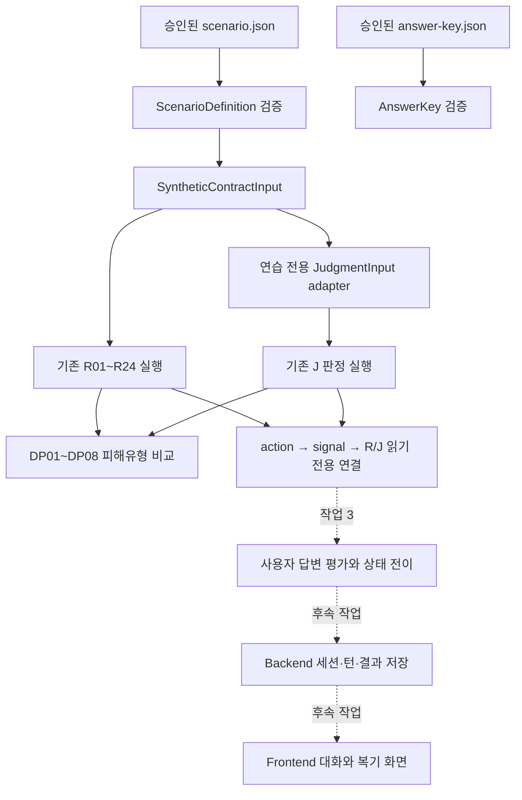

# 계약 연습 시뮬레이션 작업 이해 설명서

> 이 문서는 계약 연습 시뮬레이션을 처음 보는 사람도 현재 구현 상태와 파일 연결 관계를 이해할 수 있도록 설명합니다. 작업이 하나 끝날 때마다 같은 형식으로 갱신합니다.

- 마지막 갱신: 2026-07-22
- 현재 완료 범위: 작업 0~2
- 현재 브랜치: `main`
- 마지막 기능 커밋: `5f30026 feat(simulation): connect practice rules and judgments`
- 다음 작업: 작업 3 — 사용자 답변 평가와 상태 머신

## 1. 이 기능은 무엇인가

계약 연습 시뮬레이션은 사용자가 가상의 임대인 또는 공인중개사와 대화하면서 계약 전 확인 행동을 연습하는 기능입니다.

예를 들어 임대인이 다음과 같이 말하는 상황을 제공합니다.

> 다음 세입자가 들어오면 보증금을 돌려드리겠습니다.

사용자는 이 말을 그대로 믿고 넘어가는 대신 다음 행동을 연습합니다.

1. 보증금 반환이 후임 임차인의 입주에 달려 있는지 확인합니다.
2. 구두 설명이 아니라 계약서 특약 수정을 요구합니다.
3. 수정된 문구를 확인하기 전에는 계약 진행을 보류합니다.

이 기능은 실제 계약 분석과 목적은 비슷하지만 데이터는 분리합니다.

| 실제 계약 분석 | 계약 연습 시뮬레이션 |
|---|---|
| 사용자가 올린 실제 계약 문서를 분석 | 저장소에 승인된 합성 시나리오를 사용 |
| 실제 `contract_id`와 분석 이력을 저장 | 실제 계약 레코드를 만들지 않음 |
| 사용자의 계약 상태를 확인 | 사용자의 질문·확인 행동을 연습 |
| 계약별 결과 리포트를 제공 | 연습 대화와 최종 복기를 제공할 예정 |

현재는 **시나리오 3개를 만들고 기존 R/J/DP 판정 엔진까지 연결한 상태**입니다. 사용자 답변을 누적 평가하고 화면에서 대화하는 부분은 아직 완료되지 않았습니다.

## 2. 현재 진행상황

| 작업 | 내용 | 상태 | 근거 |
|---|---|---|---|
| 작업 0 | 기존 코드·테스트 기준선 확인 | 완료 | 기준 HEAD `ffd06fa` |
| 작업 1 | 공통 schema와 시나리오 3개 fixture 작성 | 완료 | `e28c181` |
| 작업 2 | 세 시나리오를 기존 R/J/DP 엔진에 연결 | 완료 | `5f30026` |
| 작업 3 | 사용자 답변 평가와 상태 머신 | 예정 | 미구현 |
| 작업 4 | Gemini practice provider | 예정 | 미구현 |
| 작업 5 이후 | Backend·Frontend·E2E 연결 | 예정 | 미구현 |

`완료`는 코드 작성과 관련 테스트가 끝난 상태만 의미합니다. 문서에 설계만 있는 기능은 `예정`으로 표시합니다.

## 3. 전체 흐름에서 지금 완성된 위치



실선은 작업 0~2에서 준비되거나 연결된 범위입니다. 점선은 아직 남은 작업입니다.

## 4. 먼저 알아야 할 용어

| 용어 | 쉬운 뜻 |
|---|---|
| `ScenarioDefinition` | 연습 상황 전체를 담는 공식 데이터 구조 |
| `scenario.json` | 가상 계약 정보, 상대 역할, 대화, 목표 행동을 담은 파일 |
| `answer-key.json` | 사용자 답변을 어떤 범주로 평가할지 정한 기준표 |
| Synthetic Contract | 실제 개인정보가 아닌 합성 계약 정보 |
| Fixture | 테스트와 연습에서 반복해서 사용하는 고정 입력 데이터 |
| R 판정 | 기존 최소 MVP 규칙 R01~R24 |
| J 판정 | 계약 당사자·금액·특약 등을 확인하는 J01~J12 판정 |
| DP | R/J 결과를 피해유형 관점으로 묶은 DP01~DP08 비교표 |
| Canonical Schema | AI와 Backend가 함께 따라야 하는 공식 데이터 구조 |
| Adapter | 연습 데이터를 기존 판정 엔진 입력으로 변환하는 연결 코드 |
| Signal | 사용자가 대화에서 발견해야 하는 숨은 확인 신호 |
| Target Action | 사용자가 실제로 질문하거나 보류해야 하는 목표 행동 |
| Golden Test | 특정 입력에서 반드시 약속된 결과가 나오는지 고정하는 테스트 |

### R, J, DP의 차이

R, J, DP는 같은 번호 체계가 아닙니다.

- **R**은 계약과 등기 자료를 검사하는 기존 규칙입니다.
- **J**는 계약 당사자·금액·특약 같은 판정 축입니다.
- **DP**는 R/J 결과를 피해유형 관점으로 다시 묶어 보여주는 비교 결과입니다.

예를 들어 제3자 계좌 시나리오는 다음처럼 이어집니다.

```text
임대인: 박서연
입금 계좌 명의: 공인중개사 이도윤
        ↓
R06: 입금 계좌 명의 불일치
J05: 계좌 명의와 계약 상대 불일치
        ↓
DP02: 제3자 계좌 입금 관련 확인 신호
```

DP가 R/J 결과를 바꾸는 것은 아닙니다. 이미 나온 결과를 사용자에게 이해하기 쉬운 피해유형 관점으로 묶습니다.

## 5. 관련 폴더 구조

```text
Lease-Companion/
├─ ai/
│  ├─ src/lease_companion_ai/
│  │  ├─ schemas/
│  │  │  └─ simulation.py
│  │  ├─ simulation/
│  │  │  ├─ models.py
│  │  │  ├─ rules.py
│  │  │  ├─ provider.py
│  │  │  ├─ service.py
│  │  │  ├─ evidence.py
│  │  │  └─ debrief.py
│  │  └─ risk_patterns/
│  │     └─ service.py
│  └─ tests/
│     ├─ schemas/
│     │  └─ test_simulation.py
│     └─ simulation/
│        ├─ test_evaluation.py
│        └─ test_rules.py
├─ data/
│  ├─ sample/practice-scenarios/
│  │  ├─ PRACTICE-BROKER-PRESSURE-001/
│  │  ├─ PRACTICE-DEFERRED-REFUND-001/
│  │  ├─ PRACTICE-THIRD-PARTY-PAYMENT-001/
│  │  └─ PRACTICE-PROXY-AUTHORITY-001/
│  └─ schemas/generated/
├─ docs/planning/
│  └─ practice-simulation-work-guide.md
└─ work/
   ├─ THREAD.md
   └─ 시나리오3개_AI_Backend_Frontend_연결_할일계획.md
```

`PRACTICE-BROKER-PRESSURE-001`은 기존에 있던 연습 fixture입니다. 작업 1에서 새로 추가한 핵심 시나리오는 나머지 3개입니다.

## 6. 파일별 역할과 읽는 순서

### 1순위: 시나리오 내용부터 읽기

- [조건부 보증금 반환 scenario](../../data/sample/practice-scenarios/PRACTICE-DEFERRED-REFUND-001/scenario.json)
- [제3자 계좌 scenario](../../data/sample/practice-scenarios/PRACTICE-THIRD-PARTY-PAYMENT-001/scenario.json)
- [대리인 권한 scenario](../../data/sample/practice-scenarios/PRACTICE-PROXY-AUTHORITY-001/scenario.json)

여기서 확인할 내용:

- 가상 계약 금액과 날짜
- 임대인·소유자·계좌 명의
- 대리계약 여부
- 사용자가 찾아야 하는 신호
- 사용자가 해야 하는 목표 행동
- 상대방의 대화와 압박 문구

### 2순위: 답변 평가 기준 읽기

- [조건부 보증금 반환 answer key](../../data/sample/practice-scenarios/PRACTICE-DEFERRED-REFUND-001/answer-key.json)
- [제3자 계좌 answer key](../../data/sample/practice-scenarios/PRACTICE-THIRD-PARTY-PAYMENT-001/answer-key.json)
- [대리인 권한 answer key](../../data/sample/practice-scenarios/PRACTICE-PROXY-AUTHORITY-001/answer-key.json)

여기에는 다음 내용이 있습니다.

- 행동별 평가 기준
- 적절한 확인 답변
- 일부만 확인한 답변
- 애매하거나 회피하는 답변
- 미응답 처리 예시
- provider 장애 시 `needs_review` 처리 예시
- 연습이 끝난 뒤 보여줄 권장 문구와 행동

### 3순위: 데이터 구조 읽기

- [simulation.py](../../ai/src/lease_companion_ai/schemas/simulation.py)

이 파일은 시나리오가 지켜야 하는 공식 형식을 정의합니다. 주요 구조는 다음과 같습니다.

| 구조 | 역할 |
|---|---|
| `SyntheticContractInput` | 합성 계약 정보 |
| `TargetAction` | 사용자가 수행해야 하는 행동 |
| `ConfirmationSignal` | 발견해야 하는 계약 확인 신호 |
| `DialogueTurn` | 상대방 발화와 답변 범주별 반응 |
| `ScenarioDefinition` | 시나리오 전체 |
| `PracticeTurnInput` | 사용자 답변 또는 최종 행동 입력 |
| `PracticeTurnEvaluation` | 답변 1회의 평가 결과 |
| `PracticeResult` | 최종 복기 결과 |

### 4순위: 기존 판정 엔진 연결 읽기

- [simulation/rules.py](../../ai/src/lease_companion_ai/simulation/rules.py)

작업 2의 중심 파일입니다. 주요 함수는 다음과 같습니다.

| 함수 | 역할 |
|---|---|
| `run_practice_rules()` | 합성 계약으로 기존 R01~R24 실행 |
| `build_practice_judgment_input()` | 합성 계약을 canonical J 입력으로 변환 |
| `run_practice_judgments()` | fixture가 연결한 J 판정만 실행 |
| `run_practice_damage_patterns()` | R/J 결과로 DP01~DP08 구성 |
| `link_actions_to_rules()` | 행동과 R 결과를 fixture 참조대로 연결 |
| `link_actions_to_judgments()` | 행동과 J 결과를 fixture 참조대로 연결 |

### 5순위: 피해유형 연결 읽기

- [risk_patterns/service.py](../../ai/src/lease_companion_ai/risk_patterns/service.py)

`build_damage_patterns_from_results()`가 실제 분석 실행 ID 없이 R/J 목록만 받아 DP 비교표를 만듭니다. 실제 계약 분석에서 사용하던 `build_damage_patterns()`도 같은 내부 로직을 재사용하므로 판정 의미가 갈라지지 않습니다.

### 6순위: 테스트로 약속된 결과 확인하기

- [simulation schema 테스트](../../ai/tests/schemas/test_simulation.py)
- [R/J/DP golden 테스트](../../ai/tests/simulation/test_rules.py)
- [기존 답변 평가 테스트](../../ai/tests/simulation/test_evaluation.py)

설명을 읽은 뒤 테스트의 `assert`를 보면 어떤 결과를 절대로 바꾸면 안 되는지 확인할 수 있습니다.

### 7순위: 현재 상태와 다음 작업 확인하기

- [현재 작업 상태](../../work/THREAD.md)
- [전체 할 일 계획](../../work/시나리오3개_AI_Backend_Frontend_연결_할일계획.md)

`THREAD.md`는 현재 상태를 짧게 확인할 때 사용합니다. 전체 할 일 계획은 앞으로 어떤 순서로 구현할지 확인할 때 사용합니다. 실제 구현 상태가 문서와 다르면 현재 코드·테스트·커밋을 우선합니다.

## 7. 작업 0 — 시작 상태 고정

### 무엇을 했는가

작업 0에서는 새 기능을 만들지 않았습니다. 작업 1을 시작하기 전에 기존 코드가 어떤 상태인지 기록했습니다.

- 기준 HEAD: `ffd06fab4a20204d90c223cbb98f5bbc894cf22d`
- 커밋 제목: `수정`
- 당시 `origin/main...main`: `0 0`
- AI 시뮬레이션 관련 테스트: 27개 통과
- Frontend: 19개 테스트 파일, 73개 테스트 통과
- Frontend build: 성공

### 왜 필요한가

작업 1·2를 추가한 뒤 문제가 생겼을 때 다음을 구분하기 위해서입니다.

- 원래부터 있던 문제인가?
- 시뮬레이션 작업 때문에 새로 생긴 문제인가?

작업 0은 기능 커밋이 아니라 비교 기준입니다.

### 보호한 사용자 작업

기준선을 잡을 때 이미 있던 삭제·수정·미추적 파일은 시뮬레이션 커밋에 포함하지 않았습니다. 현재 작업에서도 같은 원칙을 지킵니다.

## 8. 작업 1 — 시나리오 3개와 공통 schema

### 작업 목적

사람이 읽는 아이디어를 코드가 검증하고 실행할 수 있는 승인 fixture로 만드는 작업입니다.

커밋:

```text
e28c181 feat(simulation): add three practice scenarios
```

### 시나리오 1: 후임 임차인 조건부 보증금 반환

경로:

`data/sample/practice-scenarios/PRACTICE-DEFERRED-REFUND-001/`

핵심 계약 문구:

> 보증금은 신규 임차인이 입주한 후 반환한다.

사용자가 찾아야 하는 문제:

- 보증금 반환이 기존 임대차 종료가 아니라 신규 임차인의 입주에 달려 있습니다.
- 신규 임차인을 구하지 못하면 반환 시점이 늦어질 수 있는 문구입니다.
- 서비스는 실제 반환 여부를 예측하지 않고 문구 수정을 확인하도록 안내합니다.

목표 행동:

| ID | 행동 |
|---|---|
| PA01 | 후임 임차인 조건부 반환 구조 확인 |
| PA02 | 구두 설명 대신 반환 특약 수정 요구 |
| PA03 | 특약 수정 확인 전 계약 진행 보류 |

연결:

```text
SIG-DEFERRED-REFUND
├─ R08
└─ J10
```

### 시나리오 2: 공인중개사 명의 계좌 송금 요구

경로:

`data/sample/practice-scenarios/PRACTICE-THIRD-PARTY-PAYMENT-001/`

핵심 합성 정보:

| 항목 | 값 |
|---|---|
| 임대인·등기상 소유자 | 박서연 |
| 공인중개사 | 이도윤 |
| 안내된 계좌 명의 | 이도윤 |
| 요구한 가계약금 | 1,000,000원 |

사용자가 찾아야 하는 문제:

- 입금 계좌 명의가 임대인·등기상 소유자와 다릅니다.
- 공인중개사가 돈을 받을 권한 자료가 제시되지 않았습니다.
- 관계와 권한을 확인하기 전에 송금을 요구합니다.

목표 행동:

| ID | 행동 |
|---|---|
| PA01 | 입금 명의와 계약 상대 불일치 확인 |
| PA02 | 제3자 수령 관계와 권한 자료 확인 |
| PA03 | 확인 완료 전 가계약금 송금 보류 |

세 신호는 모두 R06·J05에 연결됩니다.

### 시나리오 3: 대리인 권한 자료 없는 계약 요구

경로:

`data/sample/practice-scenarios/PRACTICE-PROXY-AUTHORITY-001/`

핵심 합성 정보:

| 항목 | 값 |
|---|---|
| 임대인·등기상 소유자 | 한서윤 |
| 계약을 진행하는 대리인 | 박민준 |
| 대리인 관계 | 임대인의 친족 |
| 권한 자료 | 제시되지 않음 |

사용자가 찾아야 하는 문제:

- 가족이라는 구두 설명만으로 대리권을 확인할 수 없습니다.
- 위임장·인감증명서 등 권한 자료와 위임 범위가 제시되지 않았습니다.
- 권한을 확인하기 전에 서명이나 송금을 하면 안 됩니다.

목표 행동:

| ID | 행동 |
|---|---|
| PA01 | 등기상 소유자와 계약 상대 확인 |
| PA02 | 대리인 권한 서류와 권한 범위 확인 |
| PA03 | 권한 확인 전 서명·송금 보류 |

이 신호는 J01·J04에 연결됩니다. fixture가 R04를 연결하지 않았기 때문에 코드도 R04 연결을 새로 만들어내지 않습니다.

### 공통 데이터 구조 변경

작업 1에서 [simulation.py](../../ai/src/lease_companion_ai/schemas/simulation.py)에 다음 정보를 추가했습니다.

- 대리계약 여부
- 대리인 이름
- 대리인과 임대인의 관계
- 대리권 자료 목록
- 조항 분류 후보
- 최종 행동 `특약 수정 요구`
- 답변 평가의 사용자 원문 근거

Pydantic 모델이 원본이므로 generated JSON Schema도 함께 갱신했습니다.

- `scenario-definition.schema.json`
- `practice-turn-input.schema.json`
- `practice-turn-evaluation.schema.json`

### answer key 구성

새 시나리오마다 다음이 있습니다.

- 대화 3턴
- 행동 rubric 3개
- 턴별 평가 예시 13개
- 시나리오 전체 평가 예시 39개

턴별 13개는 다음 범주를 포함합니다.

| 답변 범주 | 의미 |
|---|---|
| `appropriate_check` | 필요한 내용을 구체적으로 확인 |
| `partial_check` | 일부만 확인 |
| `ambiguous_answer` | 의도가 불명확 |
| `avoidance` | 핵심 확인을 피함 |
| `no_response` | 제한 시간 동안 답변 없음 |
| `needs_review` | provider 장애나 분류 충돌로 재검토 필요 |

`needs_review`는 사용자의 오답이 아닙니다. 평가 시스템이 확정하지 못했다는 뜻입니다.

### 작업 1 테스트가 보장하는 것

- 세 시나리오와 answer key를 모두 읽을 수 있습니다.
- 시나리오 ID와 버전이 서로 일치합니다.
- 대화 3턴과 rubric 3개가 있습니다.
- 답변 범주별 필요한 예시 수가 있습니다.
- provider timeout 예시가 있습니다.
- 대리계약과 조항 분류 후보가 schema를 통과합니다.
- generated schema와 canonical 모델이 일치합니다.

작업 1 대상 테스트 결과는 `32 passed`입니다.

## 9. 작업 2 — 기존 R/J/DP 엔진 연결

### 작업 목적

작업 1의 합성 계약 정보를 기존 판정 엔진이 이해하는 형태로 바꾸고, 세 시나리오의 기대 결과를 테스트로 고정했습니다.

커밋:

```text
5f30026 feat(simulation): connect practice rules and judgments
```

### 실제 처리 순서

```text
ScenarioDefinition.synthetic_contract
        ↓
run_practice_rules()
        ↓
기존 R01~R24 실행 후 canonical RuleResult로 변환

ScenarioDefinition.synthetic_contract
        ↓
build_practice_judgment_input()
        ↓
기존 run_judgments()
        ↓
J 결과

R 결과 + J 결과
        ↓
build_damage_patterns_from_results()
        ↓
DP01~DP08
```

### 연습 전용 J adapter가 하는 일

`build_practice_judgment_input()`은 다음 순서로 동작합니다.

1. 시나리오 신호가 연결한 J 번호를 모읍니다.
2. J01~J12의 canonical 순서로 정렬합니다.
3. 해당 J 판정에 꼭 필요한 계약·등기 필드만 선택합니다.
4. 합성 계약값을 확인 완료 `ExtractedField`로 만듭니다.
5. 빈 대리권 자료는 값이 없는 상태와 `not_stated` 사유로 표현합니다.
6. 해당 J 입력 필드와 관련된 classification 후보만 전달합니다.
7. 기존 `run_judgments()`를 호출합니다.

Canonical `JudgmentInput`이 내부 식별자를 요구하기 때문에 메모리 안에서만 사용하는 practice sentinel을 사용합니다. 실제 계약 DB 레코드를 만들거나 외부 연습 결과에 노출하지 않습니다.

### 세 시나리오 golden matrix

| 시나리오 | 확정한 J 결과 | 확정한 DP 결과 |
|---|---|---|
| 후임 임차인 조건부 반환 | J10 `확인 필요` | DP08 `관련 확인 신호 있음` |
| 제3자 계좌 입금 | J05 `불일치` | DP02 `관련 확인 신호 있음` |
| 대리인 권한 자료 미확인 | J01·J04 `확인 필요` | fixture의 J 연결 유지 |

### 왜 비교 fixture도 테스트하는가

위험해 보이는 문구만 테스트하면 모든 문구를 무조건 확인 필요로 처리하는 잘못된 구현이 생길 수 있습니다. 반대 조건도 함께 검사합니다.

| 비교 조건 | 기대 결과 |
|---|---|
| 신규 임차인 입주와 관계없이 계약 종료일에 반환 | J10 `명확`, DP08 관련 신호 미확인 |
| 제3자 계좌이지만 대리계약 문맥 | J05 `확인 필요` |
| 대리계약이 아닌 직접 계약 | J04 `적용 제외` |
| 대리인 권한 시나리오의 action 연결 | R04를 임의로 연결하지 않음 |

이 테스트 덕분에 `불일치`, `확인 필요`, `적용 제외`, `명확`을 서로 구분할 수 있습니다.

### 작업 2에서 변경한 파일

| 파일 | 변경 내용 |
|---|---|
| `simulation/rules.py` | 연습 R 실행, J adapter, J 실행, DP 실행, action 연결 |
| `risk_patterns/service.py` | 실제 분석 ID 없이 R/J 목록으로 DP를 만드는 재사용 진입점 추가 |
| `tests/simulation/test_rules.py` | 세 시나리오와 비교 조건의 golden test 추가 |

### 작업 2 테스트가 보장하는 것

- 세 시나리오 모두 R01~R24 전체가 실행됩니다.
- fixture에 연결된 J만 canonical 순서로 실행됩니다.
- 조건부 반환은 J10·DP08로 연결됩니다.
- 제3자 계좌는 J05·DP02로 연결됩니다.
- 대리계약은 J01·J04 확인 필요로 구분됩니다.
- action 연결이 fixture의 signal 참조를 벗어나지 않습니다.
- LLM이나 DP 계층이 R/J 상태를 변경하지 않습니다.
- 실제 계약 snapshot을 만들지 않습니다.

검증 결과:

- 작업 2 관련 회귀: `47 passed`
- 작업 3 전 기존 문제 수정 후 AI 전체: `372 passed, 1 skipped`
- Ruff: 통과
- mypy: 변경 소스 통과

## 10. 작업 3 전에 해결한 기존 문제

작업 2까지는 아래 두 회귀 실패를 시뮬레이션 작업과 분리해 기록했습니다. 작업 3을 시작하기 전에 원인을 확인하고 수정했습니다.

### 1. RAG 원문 해시 불일치

#### 증상

`SRC-HTA-DECREE.txt`와 `SRC-HTA-LAW.txt`의 실제 SHA256이 공식자료 metadata의 `content_sha256`과 달라 RAG manifest 테스트가 실패했습니다.

#### 원인

저장소는 `.gitattributes`에서 두 원문을 LF 줄바꿈으로 저장합니다. metadata에는 같은 내용을 Windows CRLF 줄바꿈으로 계산한 해시가 들어가 있었습니다.

- 시행령 LF 실제 해시: `06af4fb0...`
- 시행령 metadata의 잘못된 CRLF 해시: `d6e477e8...`
- 법률 LF 실제 해시: `8868f680...`
- 법률 metadata의 잘못된 CRLF 해시: `7476c7fe...`

법령 내용이 달라진 문제가 아니라 같은 텍스트의 줄바꿈 바이트 기준이 달랐던 문제입니다.

#### 수정

`official_sources.jsonl`의 두 `content_sha256`과 그 값에 종속된 `metadata_sha256`을 저장소의 실제 LF 원문 기준으로 복구했습니다.

### 2. 생성 평가 기대치 불일치

#### 증상

Offline generation 평가의 `trigger_coverage_rate`가 약 `0.979865`로 계산되어 기대값 `1.0`에 미치지 못했습니다.

#### 원인

누락으로 계산된 항목은 TEST-005의 R08·R09와 TEST-006의 R08이었습니다. 하지만 실제 사용자 안내 누락은 아니었습니다.

- J10 안내가 있으면 같은 의미의 legacy R08 안내를 제외합니다.
- J11 안내가 있으면 같은 의미의 legacy R09 안내를 제외합니다.

이는 사용자 화면에 중복 설명을 만들지 않기 위한 정상 동작입니다. 생성기는 이 규칙을 적용했지만 Offline 평가의 분모는 여전히 모든 활성 R을 세고 있었습니다.

#### 수정

`rule_results_requiring_guidance()`를 생성 서비스의 단일 기준 함수로 만들었습니다. 실제 생성과 Offline 평가가 이 함수를 함께 사용해 J10/J11이 대체한 R08/R09를 예상 안내 수에서 제외합니다.

### 수정 후 검증

- 문제 관련 테스트: `21 passed`
- AI 전체: `372 passed, 1 skipped`
- Ruff: 통과
- mypy: 변경 소스 2개 통과

이제 기존 두 실패를 제외하지 않고 AI 전체 회귀가 통과합니다.

## 11. 아직 구현하지 않은 부분

### 작업 3 — 사용자 답변 평가와 상태 머신

예정 내용:

- 사용자의 답변 의도 분류
- 확인한 행동 ID 누적
- 같은 턴 재질문 또는 다음 턴 이동
- 미응답 처리
- provider 장애를 `needs_review`로 분리
- 최종 행동 선택 전환

### 작업 4 — Gemini practice provider

예정 내용:

- 기존 Gemini SDK 방식 재사용
- 구조화된 답변 평가 출력
- API 키가 없을 때 안전한 Fake provider 사용
- 실제 API 호출은 별도 승인 후 smoke test

### Backend·Frontend 연결

예정 내용:

- 연습 세션·턴·최종 결과 저장
- 시나리오 목록·소개·대화·복기 API
- Frontend 시나리오 카드와 대화 화면
- 새로고침 후 세션 복원
- 실제 로컬 Frontend↔Backend E2E

현재 이 기능들은 설계와 기존 일부 기반 코드가 있을 수 있지만, 세 신규 시나리오 전체 연결 완료로 표시하지 않습니다.

## 12. 작업이 끝날 때마다 이 문서를 갱신하는 규칙

앞으로 각 작업을 완료할 때 다음 순서로 이 문서를 갱신합니다.

1. `git diff`와 `git show --name-status`로 실제 변경 파일을 확인합니다.
2. 해당 작업의 완료 조건과 테스트 결과를 확인합니다.
3. 상단의 `현재 완료 범위`, `마지막 기능 커밋`, `다음 작업`을 수정합니다.
4. 진행상황 표에서 해당 작업을 `완료`로 변경합니다.
5. 새 폴더나 파일이 생겼다면 관련 폴더 구조를 갱신합니다.
6. 해당 작업 설명에 목적·흐름·파일·테스트·제한을 기록합니다.
7. 전체 Mermaid 흐름에서 실제로 연결된 단계만 실선 또는 완료 상태로 바꿉니다.
8. 기존 문제와 새 문제를 구분해 기록합니다.
9. 아래 변경 이력에 날짜와 커밋을 추가합니다.
10. 가능하면 기능 코드와 이 문서 갱신을 같은 작업 커밋에 포함합니다.

### 작업별 설명 형식

모든 후속 작업은 같은 순서로 기록합니다.

```text
작업 목적
→ 구현 전과 구현 후의 차이
→ 입력과 출력
→ 실제 처리 흐름
→ 변경한 파일과 역할
→ 세 시나리오에서의 동작
→ 테스트가 보장하는 내용
→ 아직 남은 제한
→ 완료 커밋
```

### 정보의 우선순위

문서와 코드가 다르면 다음 순서로 현재 사실을 확인합니다.

1. 현재 코드
2. 자동화 테스트
3. generated schema와 fixture
4. Git 커밋
5. `work/THREAD.md`
6. 오래된 계획·인계 문서

## 13. 문서를 읽고 확인할 수 있어야 하는 질문

이 문서는 최소한 다음 질문에 답할 수 있어야 합니다.

- 시나리오 3개는 어느 폴더에 있는가?
- `scenario.json`과 `answer-key.json`의 차이는 무엇인가?
- 작업 1과 작업 2의 차이는 무엇인가?
- R, J, DP는 각각 무엇인가?
- 합성 시나리오가 기존 판정 엔진에 어떻게 연결되는가?
- 세 시나리오에서 기대하는 판정 결과는 무엇인가?
- 어떤 테스트가 그 결과를 보장하는가?
- 전체 테스트에 남은 기존 문제는 무엇인가?
- 다음 작업은 무엇인가?

## 14. 변경 이력

| 날짜 | 문서 반영 범위 | 관련 커밋 | 비고 |
|---|---|---|---|
| 2026-07-22 | 작업 0~2 | `ffd06fa`, `e28c181`, `5f30026` | 최초 작성 |
| 2026-07-22 | 작업 3 전 기존 회귀 문제 수정 | `117ebd9` | RAG LF 해시와 generation coverage 기준 정합화 |
