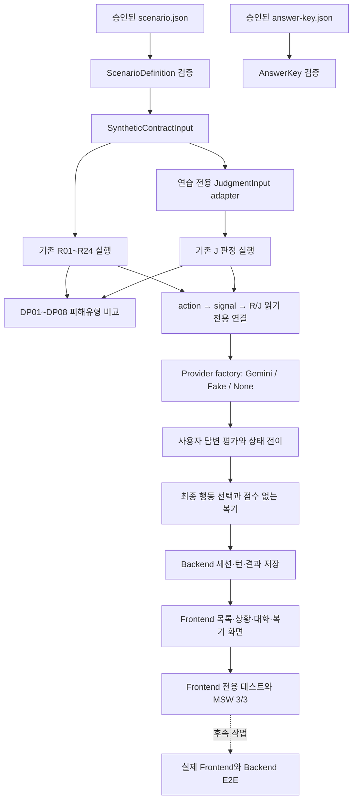

# 계약 연습 시뮬레이션 작업 이해 설명서

> 이 문서는 계약 연습 시뮬레이션을 처음 보는 사람도 현재 구현 상태와 파일 연결 관계를 이해할 수 있도록 설명합니다. 작업이 하나 끝날 때마다 같은 형식으로 갱신합니다.

- 마지막 갱신: 2026-07-22
- 현재 완료 범위: 작업 0~8
- 현재 브랜치: `main`
- 마지막 커밋: `9d2ae25 test(practice): cover frontend simulation flow`
- 작업 7 커밋: `332f425 feat(practice): add frontend simulation flow`
- 작업 8 상태: 구현·검증·커밋 완료
- 다음 작업: 작업 9 — Fake provider 기반 실제 Frontend↔Backend E2E

## 1. 이 기능은 무엇인가

계약 연습 시뮬레이션은 사용자가 가상의 임대인 또는 공인중개사와 대화하면서 계약 전 확인 행동을 연습하는 기능입니다.

예를 들어 임대인이 다음과 같이 말하는 상황을 제공합니다.

> 다음 세입자가 들어오면 보증금을 돌려드리겠습니다.

사용자는 이 말을 그대로 믿고 넘어가는 대신 다음 행동을 연습합니다.

1. 보증금 반환이 후임 임차인의 입주에 달려 있는지 확인합니다.
2. 구두 설명이 아니라 계약서 특약 수정을 요구합니다.
3. 수정된 문구를 확인하기 전에는 계약 진행을 보류합니다.

이 기능은 실제 계약 분석과 목적은 비슷하지만 데이터는 분리합니다.

| 실제 계약 분석 | 계약 연습 시뮬레이션 |
|---|---|
| 사용자가 올린 실제 계약 문서를 분석 | 저장소에 승인된 합성 시나리오를 사용 |
| 실제 `contract_id`와 분석 이력을 저장 | 실제 계약 레코드를 만들지 않음 |
| 사용자의 계약 상태를 확인 | 사용자의 질문·확인 행동을 연습 |
| 계약별 결과 리포트를 제공 | 연습 대화와 최종 복기를 제공 |

현재는 **시나리오 3개, 기존 R/J/DP 연결, 사용자 답변 평가, 누적 상태 머신, Gemini/Fake provider 선택, Backend 세션·턴·결과 저장 API, Frontend 목록·상황·대화·복기 화면, MSW와 Frontend 전용 자동화 테스트까지 완성한 상태**입니다. 실제 Frontend↔Backend E2E와 실제 Gemini 네트워크 smoke는 아직 완료되지 않았습니다.

## 2. 현재 진행상황

| 작업 | 내용 | 상태 | 근거 |
|---|---|---|---|
| 작업 0 | 기존 코드·테스트 기준선 확인 | 완료 | 기준 HEAD `ffd06fa` |
| 작업 1 | 공통 schema와 시나리오 3개 fixture 작성 | 완료 | `e28c181` |
| 작업 2 | 세 시나리오를 기존 R/J/DP 엔진에 연결 | 완료 | `5f30026` |
| 작업 3 | 사용자 답변 평가와 상태 머신 | 완료 | 작업 3 관련 `154 passed` |
| 작업 4 | Gemini practice provider | 완료 | provider `128 passed, 1 skipped` |
| 작업 5 | Backend 세션·턴·결과 DB·API | 완료 | Backend `66 passed`, 세 시나리오 API smoke 통과 |
| 작업 6 | 세 시나리오 Backend API 자동화 테스트 | 완료 | 전용 `9 passed`, Backend 전체 `75 passed` |
| 작업 7 | 세 시나리오 Frontend 타입·서비스·화면·MSW | 완료 | build 성공, 기존 Frontend `75 passed` |
| 작업 8 | 세 시나리오 Frontend 전용 테스트·빌드 | 완료 | 전용 `19 passed`, 전체 `94 passed`, build 성공 |
| 작업 9 이후 | 실제 Frontend↔Backend E2E·전체 회귀 | 예정 | 미구현 |

`완료`는 코드 작성과 관련 테스트가 끝난 상태만 의미합니다. 문서에 설계만 있는 기능은 `예정`으로 표시합니다.

## 3. 전체 흐름에서 지금 완성된 위치



실선은 작업 0~8에서 준비되거나 연결된 범위입니다. 점선은 아직 남은 작업입니다.

## 4. 먼저 알아야 할 용어

| 용어 | 쉬운 뜻 |
|---|---|
| `ScenarioDefinition` | 연습 상황 전체를 담는 공식 데이터 구조 |
| `scenario.json` | 가상 계약 정보, 상대 역할, 대화, 목표 행동을 담은 파일 |
| `answer-key.json` | 사용자 답변을 어떤 범주로 평가할지 정한 기준표 |
| Synthetic Contract | 실제 개인정보가 아닌 합성 계약 정보 |
| Fixture | 테스트와 연습에서 반복해서 사용하는 고정 입력 데이터 |
| R 판정 | 기존 최소 MVP 규칙 R01~R24 |
| J 판정 | 계약 당사자·금액·특약 등을 확인하는 J01~J12 판정 |
| DP | R/J 결과를 피해유형 관점으로 묶은 DP01~DP08 비교표 |
| Canonical Schema | AI와 Backend가 함께 따라야 하는 공식 데이터 구조 |
| Adapter | 연습 데이터를 기존 판정 엔진 입력으로 변환하는 연결 코드 |
| Signal | 사용자가 대화에서 발견해야 하는 숨은 확인 신호 |
| Target Action | 사용자가 실제로 질문하거나 보류해야 하는 목표 행동 |
| Effect Tag | 확인된 행동이 문서 요청·계약 보류·송금 보류 중 무엇인지 나타내는 데이터 태그 |
| State Machine | 같은 입력과 상태에서 항상 같은 다음 상태를 만드는 전이 규칙 |
| Golden Test | 특정 입력에서 반드시 약속된 결과가 나오는지 고정하는 테스트 |

### R, J, DP의 차이

R, J, DP는 같은 번호 체계가 아닙니다.

- **R**은 계약과 등기 자료를 검사하는 기존 규칙입니다.
- **J**는 계약 당사자·금액·특약 같은 판정 축입니다.
- **DP**는 R/J 결과를 피해유형 관점으로 다시 묶어 보여주는 비교 결과입니다.

예를 들어 제3자 계좌 시나리오는 다음처럼 이어집니다.

```text
임대인: 박서연
입금 계좌 명의: 공인중개사 이도윤
        ↓
R06: 입금 계좌 명의 불일치
J05: 계좌 명의와 계약 상대 불일치
        ↓
DP02: 제3자 계좌 입금 관련 확인 신호
```

DP가 R/J 결과를 바꾸는 것은 아닙니다. 이미 나온 결과를 사용자에게 이해하기 쉬운 피해유형 관점으로 묶습니다.

## 5. 관련 폴더 구조

```text
Lease-Companion/
├─ ai/
│  ├─ src/lease_companion_ai/
│  │  ├─ schemas/
│  │  │  └─ simulation.py
│  │  ├─ simulation/
│  │  │  ├─ models.py
│  │  │  ├─ rules.py
│  │  │  ├─ provider.py
│  │  │  ├─ service.py
│  │  │  ├─ state_machine.py
│  │  │  ├─ evidence.py
│  │  │  └─ debrief.py
│  │  ├─ providers/
│  │  │  └─ gemini_practice.py
│  │  └─ risk_patterns/
│  │     └─ service.py
│  └─ tests/
│     ├─ schemas/
│     │  └─ test_simulation.py
│     ├─ providers/
│     │  ├─ test_gemini_practice.py
│     │  └─ test_gemini_practice_smoke.py
│     └─ simulation/
│        ├─ test_evaluation.py
│        ├─ test_state_machine.py
│        └─ test_rules.py
├─ backend/
│  ├─ alembic/versions/
│  │  └─ d4e5f6a7b8c9_add_practice_sessions_and_turns.py
│  ├─ app/
│     ├─ api/routes/practice.py
│     ├─ models/practice.py
│     ├─ schemas/practice.py
│     └─ services/practice.py
│  └─ tests/api/
│     └─ test_practice.py
├─ frontend/
│  ├─ src/
│  │  ├─ components/layout/PageShell.tsx
│  │  ├─ mocks/
│  │  │  ├─ handlers.ts
│  │  │  └─ practice.ts
│  │  ├─ pages/
│  │  │  ├─ dashboard/DashboardPage.tsx
│  │  │  └─ practice/
│  │  │     ├─ PracticeHomePage.tsx
│  │  │     ├─ PracticeScenarioPage.tsx
│  │  │     ├─ PracticeSessionPage.tsx
│  │  │     └─ PracticeResultPage.tsx
│  │  ├─ services/practiceService.ts
│  │  ├─ styles/global.css
│  │  ├─ types/api.ts
│  │  └─ router.tsx
│  └─ tests/
│     ├─ mocks/practice.test.ts
│     ├─ pages/practice-pages.test.tsx
│     └─ services/practice-service.test.ts
├─ data/
│  ├─ sample/practice-scenarios/
│  │  ├─ PRACTICE-BROKER-PRESSURE-001/
│  │  ├─ PRACTICE-DEFERRED-REFUND-001/
│  │  ├─ PRACTICE-THIRD-PARTY-PAYMENT-001/
│  │  └─ PRACTICE-PROXY-AUTHORITY-001/
│  └─ schemas/generated/
├─ docs/
│  ├─ planning/practice-simulation-work-guide.md
│  └─ testing/practice-real-api-validation.md
└─ work/
   ├─ THREAD.md
   └─ 시나리오3개_AI_Backend_Frontend_연결_할일계획.md
```

`PRACTICE-BROKER-PRESSURE-001`은 기존에 있던 연습 fixture입니다. 작업 1에서 새로 추가한 핵심 시나리오는 나머지 3개입니다.

## 6. 파일별 역할과 읽는 순서

### 1순위: 시나리오 내용부터 읽기

- [조건부 보증금 반환 scenario](../../data/sample/practice-scenarios/PRACTICE-DEFERRED-REFUND-001/scenario.json)
- [제3자 계좌 scenario](../../data/sample/practice-scenarios/PRACTICE-THIRD-PARTY-PAYMENT-001/scenario.json)
- [대리인 권한 scenario](../../data/sample/practice-scenarios/PRACTICE-PROXY-AUTHORITY-001/scenario.json)

여기서 확인할 내용:

- 가상 계약 금액과 날짜
- 임대인·소유자·계좌 명의
- 대리계약 여부
- 사용자가 찾아야 하는 신호
- 사용자가 해야 하는 목표 행동
- 상대방의 대화와 압박 문구

### 2순위: 답변 평가 기준 읽기

- [조건부 보증금 반환 answer key](../../data/sample/practice-scenarios/PRACTICE-DEFERRED-REFUND-001/answer-key.json)
- [제3자 계좌 answer key](../../data/sample/practice-scenarios/PRACTICE-THIRD-PARTY-PAYMENT-001/answer-key.json)
- [대리인 권한 answer key](../../data/sample/practice-scenarios/PRACTICE-PROXY-AUTHORITY-001/answer-key.json)

여기에는 다음 내용이 있습니다.

- 행동별 평가 기준
- 적절한 확인 답변
- 일부만 확인한 답변
- 애매하거나 회피하는 답변
- 미응답 처리 예시
- provider 장애 시 `needs_review` 처리 예시
- 연습이 끝난 뒤 보여줄 권장 문구와 행동

### 3순위: 데이터 구조 읽기

- [simulation.py](../../ai/src/lease_companion_ai/schemas/simulation.py)

이 파일은 시나리오가 지켜야 하는 공식 형식을 정의합니다. 주요 구조는 다음과 같습니다.

| 구조 | 역할 |
|---|---|
| `SyntheticContractInput` | 합성 계약 정보 |
| `TargetAction` | 사용자가 수행해야 하는 행동 |
| `ConfirmationSignal` | 발견해야 하는 계약 확인 신호 |
| `DialogueTurn` | 상대방 발화와 답변 범주별 반응 |
| `ScenarioDefinition` | 시나리오 전체 |
| `PracticeTurnInput` | 사용자 답변 또는 최종 행동 입력 |
| `PracticeTurnEvaluation` | 답변 1회의 평가 결과 |
| `PracticeResult` | 최종 복기 결과 |

### 4순위: 기존 판정 엔진 연결 읽기

- [simulation/rules.py](../../ai/src/lease_companion_ai/simulation/rules.py)

작업 2의 중심 파일입니다. 주요 함수는 다음과 같습니다.

| 함수 | 역할 |
|---|---|
| `run_practice_rules()` | 합성 계약으로 기존 R01~R24 실행 |
| `build_practice_judgment_input()` | 합성 계약을 canonical J 입력으로 변환 |
| `run_practice_judgments()` | fixture가 연결한 J 판정만 실행 |
| `run_practice_damage_patterns()` | R/J 결과로 DP01~DP08 구성 |
| `link_actions_to_rules()` | 행동과 R 결과를 fixture 참조대로 연결 |
| `link_actions_to_judgments()` | 행동과 J 결과를 fixture 참조대로 연결 |

### 5순위: 답변 평가와 상태 전이 읽기

- [simulation/service.py](../../ai/src/lease_companion_ai/simulation/service.py)
- [simulation/state_machine.py](../../ai/src/lease_companion_ai/simulation/state_machine.py)
- [simulation/debrief.py](../../ai/src/lease_companion_ai/simulation/debrief.py)

`service.py`는 한 턴 평가와 세션 흐름을 묶습니다. `state_machine.py`는 행동·신호·보류 여부를 누적하고 다음 상태를 결정합니다. `debrief.py`는 누적 평가와 최종 행동을 점수 없는 복기 결과로 바꿉니다.

### 6순위: Gemini·Fake 선택 읽기

- [Gemini practice provider](../../ai/src/lease_companion_ai/providers/gemini_practice.py)

`build_practice_provider()`를 보면 실행 환경별 선택 순서를 확인할 수 있습니다. API 키가 있으면 Gemini, 키가 없고 offline mode이면 승인 answer key 기반 Fake, 둘 다 아니면 `None`을 반환해 기존 `needs_review` fallback을 사용합니다.

### 7순위: 피해유형 연결 읽기

- [risk_patterns/service.py](../../ai/src/lease_companion_ai/risk_patterns/service.py)

`build_damage_patterns_from_results()`가 실제 분석 실행 ID 없이 R/J 목록만 받아 DP 비교표를 만듭니다. 실제 계약 분석에서 사용하던 `build_damage_patterns()`도 같은 내부 로직을 재사용하므로 판정 의미가 갈라지지 않습니다.

### 8순위: 테스트로 약속된 결과 확인하기

- [simulation schema 테스트](../../ai/tests/schemas/test_simulation.py)
- [R/J/DP golden 테스트](../../ai/tests/simulation/test_rules.py)
- [기존 답변 평가 테스트](../../ai/tests/simulation/test_evaluation.py)
- [세 시나리오 전체 예시와 상태 머신 테스트](../../ai/tests/simulation/test_state_machine.py)
- [Gemini mock·Fake·키 선택 테스트](../../ai/tests/providers/test_gemini_practice.py)
- [기본 skip 실제 Gemini smoke](../../ai/tests/providers/test_gemini_practice_smoke.py)

설명을 읽은 뒤 테스트의 `assert`를 보면 어떤 결과를 절대로 바꾸면 안 되는지 확인할 수 있습니다.

### 9순위: 현재 상태와 다음 작업 확인하기

- [현재 작업 상태](../../work/THREAD.md)
- [전체 할 일 계획](../../work/시나리오3개_AI_Backend_Frontend_연결_할일계획.md)

`THREAD.md`는 현재 상태를 짧게 확인할 때 사용합니다. 전체 할 일 계획은 앞으로 어떤 순서로 구현할지 확인할 때 사용합니다. 실제 구현 상태가 문서와 다르면 현재 코드·테스트·커밋을 우선합니다.

## 7. 작업 0 — 시작 상태 고정

### 무엇을 했는가

작업 0에서는 새 기능을 만들지 않았습니다. 작업 1을 시작하기 전에 기존 코드가 어떤 상태인지 기록했습니다.

- 기준 HEAD: `ffd06fab4a20204d90c223cbb98f5bbc894cf22d`
- 커밋 제목: `수정`
- 당시 `origin/main...main`: `0 0`
- AI 시뮬레이션 관련 테스트: 27개 통과
- Frontend: 19개 테스트 파일, 75개 테스트 통과
- Frontend build: 성공

### 왜 필요한가

작업 1·2를 추가한 뒤 문제가 생겼을 때 다음을 구분하기 위해서입니다.

- 원래부터 있던 문제인가?
- 시뮬레이션 작업 때문에 새로 생긴 문제인가?

작업 0은 기능 커밋이 아니라 비교 기준입니다.

### 보호한 사용자 작업

기준선을 잡을 때 이미 있던 삭제·수정·미추적 파일은 시뮬레이션 커밋에 포함하지 않았습니다. 현재 작업에서도 같은 원칙을 지킵니다.

## 8. 작업 1 — 시나리오 3개와 공통 schema

### 작업 목적

사람이 읽는 아이디어를 코드가 검증하고 실행할 수 있는 승인 fixture로 만드는 작업입니다.

커밋:

```text
e28c181 feat(simulation): add three practice scenarios
```

### 시나리오 1: 후임 임차인 조건부 보증금 반환

경로:

`data/sample/practice-scenarios/PRACTICE-DEFERRED-REFUND-001/`

핵심 계약 문구:

> 보증금은 신규 임차인이 입주한 후 반환한다.

사용자가 찾아야 하는 문제:

- 보증금 반환이 기존 임대차 종료가 아니라 신규 임차인의 입주에 달려 있습니다.
- 신규 임차인을 구하지 못하면 반환 시점이 늦어질 수 있는 문구입니다.
- 서비스는 실제 반환 여부를 예측하지 않고 문구 수정을 확인하도록 안내합니다.

목표 행동:

| ID | 행동 |
|---|---|
| PA01 | 후임 임차인 조건부 반환 구조 확인 |
| PA02 | 구두 설명 대신 반환 특약 수정 요구 |
| PA03 | 특약 수정 확인 전 계약 진행 보류 |

연결:

```text
SIG-DEFERRED-REFUND
├─ R08
└─ J10
```

### 시나리오 2: 공인중개사 명의 계좌 송금 요구

경로:

`data/sample/practice-scenarios/PRACTICE-THIRD-PARTY-PAYMENT-001/`

핵심 합성 정보:

| 항목 | 값 |
|---|---|
| 임대인·등기상 소유자 | 박서연 |
| 공인중개사 | 이도윤 |
| 안내된 계좌 명의 | 이도윤 |
| 요구한 가계약금 | 1,000,000원 |

사용자가 찾아야 하는 문제:

- 입금 계좌 명의가 임대인·등기상 소유자와 다릅니다.
- 공인중개사가 돈을 받을 권한 자료가 제시되지 않았습니다.
- 관계와 권한을 확인하기 전에 송금을 요구합니다.

목표 행동:

| ID | 행동 |
|---|---|
| PA01 | 입금 명의와 계약 상대 불일치 확인 |
| PA02 | 제3자 수령 관계와 권한 자료 확인 |
| PA03 | 확인 완료 전 가계약금 송금 보류 |

세 신호는 모두 R06·J05에 연결됩니다.

### 시나리오 3: 대리인 권한 자료 없는 계약 요구

경로:

`data/sample/practice-scenarios/PRACTICE-PROXY-AUTHORITY-001/`

핵심 합성 정보:

| 항목 | 값 |
|---|---|
| 임대인·등기상 소유자 | 한서윤 |
| 계약을 진행하는 대리인 | 박민준 |
| 대리인 관계 | 임대인의 친족 |
| 권한 자료 | 제시되지 않음 |

사용자가 찾아야 하는 문제:

- 가족이라는 구두 설명만으로 대리권을 확인할 수 없습니다.
- 위임장·인감증명서 등 권한 자료와 위임 범위가 제시되지 않았습니다.
- 권한을 확인하기 전에 서명이나 송금을 하면 안 됩니다.

목표 행동:

| ID | 행동 |
|---|---|
| PA01 | 등기상 소유자와 계약 상대 확인 |
| PA02 | 대리인 권한 서류와 권한 범위 확인 |
| PA03 | 권한 확인 전 서명·송금 보류 |

이 신호는 J01·J04에 연결됩니다. fixture가 R04를 연결하지 않았기 때문에 코드도 R04 연결을 새로 만들어내지 않습니다.

### 공통 데이터 구조 변경

작업 1에서 [simulation.py](../../ai/src/lease_companion_ai/schemas/simulation.py)에 다음 정보를 추가했습니다.

- 대리계약 여부
- 대리인 이름
- 대리인과 임대인의 관계
- 대리권 자료 목록
- 조항 분류 후보
- 최종 행동 `특약 수정 요구`
- 답변 평가의 사용자 원문 근거

Pydantic 모델이 원본이므로 generated JSON Schema도 함께 갱신했습니다.

- `scenario-definition.schema.json`
- `practice-turn-input.schema.json`
- `practice-turn-evaluation.schema.json`

### answer key 구성

새 시나리오마다 다음이 있습니다.

- 대화 3턴
- 행동 rubric 3개
- 턴별 평가 예시 13개
- 시나리오 전체 평가 예시 39개

턴별 13개는 다음 범주를 포함합니다.

| 답변 범주 | 의미 |
|---|---|
| `appropriate_check` | 필요한 내용을 구체적으로 확인 |
| `partial_check` | 일부만 확인 |
| `ambiguous_answer` | 의도가 불명확 |
| `avoidance` | 핵심 확인을 피함 |
| `no_response` | 제한 시간 동안 답변 없음 |
| `needs_review` | provider 장애나 분류 충돌로 재검토 필요 |

`needs_review`는 사용자의 오답이 아닙니다. 평가 시스템이 확정하지 못했다는 뜻입니다.

### 작업 1 테스트가 보장하는 것

- 세 시나리오와 answer key를 모두 읽을 수 있습니다.
- 시나리오 ID와 버전이 서로 일치합니다.
- 대화 3턴과 rubric 3개가 있습니다.
- 답변 범주별 필요한 예시 수가 있습니다.
- provider timeout 예시가 있습니다.
- 대리계약과 조항 분류 후보가 schema를 통과합니다.
- generated schema와 canonical 모델이 일치합니다.

작업 1 대상 테스트 결과는 `32 passed`입니다.

## 9. 작업 2 — 기존 R/J/DP 엔진 연결

### 작업 목적

작업 1의 합성 계약 정보를 기존 판정 엔진이 이해하는 형태로 바꾸고, 세 시나리오의 기대 결과를 테스트로 고정했습니다.

커밋:

```text
5f30026 feat(simulation): connect practice rules and judgments
```

### 실제 처리 순서

```text
ScenarioDefinition.synthetic_contract
        ↓
run_practice_rules()
        ↓
기존 R01~R24 실행 후 canonical RuleResult로 변환

ScenarioDefinition.synthetic_contract
        ↓
build_practice_judgment_input()
        ↓
기존 run_judgments()
        ↓
J 결과

R 결과 + J 결과
        ↓
build_damage_patterns_from_results()
        ↓
DP01~DP08
```

### 연습 전용 J adapter가 하는 일

`build_practice_judgment_input()`은 다음 순서로 동작합니다.

1. 시나리오 신호가 연결한 J 번호를 모읍니다.
2. J01~J12의 canonical 순서로 정렬합니다.
3. 해당 J 판정에 꼭 필요한 계약·등기 필드만 선택합니다.
4. 합성 계약값을 확인 완료 `ExtractedField`로 만듭니다.
5. 빈 대리권 자료는 값이 없는 상태와 `not_stated` 사유로 표현합니다.
6. 해당 J 입력 필드와 관련된 classification 후보만 전달합니다.
7. 기존 `run_judgments()`를 호출합니다.

Canonical `JudgmentInput`이 내부 식별자를 요구하기 때문에 메모리 안에서만 사용하는 practice sentinel을 사용합니다. 실제 계약 DB 레코드를 만들거나 외부 연습 결과에 노출하지 않습니다.

### 세 시나리오 golden matrix

| 시나리오 | 확정한 J 결과 | 확정한 DP 결과 |
|---|---|---|
| 후임 임차인 조건부 반환 | J10 `확인 필요` | DP08 `관련 확인 신호 있음` |
| 제3자 계좌 입금 | J05 `불일치` | DP02 `관련 확인 신호 있음` |
| 대리인 권한 자료 미확인 | J01·J04 `확인 필요` | fixture의 J 연결 유지 |

### 왜 비교 fixture도 테스트하는가

위험해 보이는 문구만 테스트하면 모든 문구를 무조건 확인 필요로 처리하는 잘못된 구현이 생길 수 있습니다. 반대 조건도 함께 검사합니다.

| 비교 조건 | 기대 결과 |
|---|---|
| 신규 임차인 입주와 관계없이 계약 종료일에 반환 | J10 `명확`, DP08 관련 신호 미확인 |
| 제3자 계좌이지만 대리계약 문맥 | J05 `확인 필요` |
| 대리계약이 아닌 직접 계약 | J04 `적용 제외` |
| 대리인 권한 시나리오의 action 연결 | R04를 임의로 연결하지 않음 |

이 테스트 덕분에 `불일치`, `확인 필요`, `적용 제외`, `명확`을 서로 구분할 수 있습니다.

### 작업 2에서 변경한 파일

| 파일 | 변경 내용 |
|---|---|
| `simulation/rules.py` | 연습 R 실행, J adapter, J 실행, DP 실행, action 연결 |
| `risk_patterns/service.py` | 실제 분석 ID 없이 R/J 목록으로 DP를 만드는 재사용 진입점 추가 |
| `tests/simulation/test_rules.py` | 세 시나리오와 비교 조건의 golden test 추가 |

### 작업 2 테스트가 보장하는 것

- 세 시나리오 모두 R01~R24 전체가 실행됩니다.
- fixture에 연결된 J만 canonical 순서로 실행됩니다.
- 조건부 반환은 J10·DP08로 연결됩니다.
- 제3자 계좌는 J05·DP02로 연결됩니다.
- 대리계약은 J01·J04 확인 필요로 구분됩니다.
- action 연결이 fixture의 signal 참조를 벗어나지 않습니다.
- LLM이나 DP 계층이 R/J 상태를 변경하지 않습니다.
- 실제 계약 snapshot을 만들지 않습니다.

검증 결과:

- 작업 2 관련 회귀: `47 passed`
- 작업 3 전 기존 문제 수정 후 AI 전체: `372 passed, 1 skipped`
- Ruff: 통과
- mypy: 변경 소스 통과

## 10. 작업 3 전에 해결한 기존 문제

작업 2까지는 아래 두 회귀 실패를 시뮬레이션 작업과 분리해 기록했습니다. 작업 3을 시작하기 전에 원인을 확인하고 수정했습니다.

### 1. RAG 원문 해시 불일치

#### 증상

`SRC-HTA-DECREE.txt`와 `SRC-HTA-LAW.txt`의 실제 SHA256이 공식자료 metadata의 `content_sha256`과 달라 RAG manifest 테스트가 실패했습니다.

#### 원인

저장소는 `.gitattributes`에서 두 원문을 LF 줄바꿈으로 저장합니다. metadata에는 같은 내용을 Windows CRLF 줄바꿈으로 계산한 해시가 들어가 있었습니다.

- 시행령 LF 실제 해시: `06af4fb0...`
- 시행령 metadata의 잘못된 CRLF 해시: `d6e477e8...`
- 법률 LF 실제 해시: `8868f680...`
- 법률 metadata의 잘못된 CRLF 해시: `7476c7fe...`

법령 내용이 달라진 문제가 아니라 같은 텍스트의 줄바꿈 바이트 기준이 달랐던 문제입니다.

#### 수정

`official_sources.jsonl`의 두 `content_sha256`과 그 값에 종속된 `metadata_sha256`을 저장소의 실제 LF 원문 기준으로 복구했습니다.

### 2. 생성 평가 기대치 불일치

#### 증상

Offline generation 평가의 `trigger_coverage_rate`가 약 `0.979865`로 계산되어 기대값 `1.0`에 미치지 못했습니다.

#### 원인

누락으로 계산된 항목은 TEST-005의 R08·R09와 TEST-006의 R08이었습니다. 하지만 실제 사용자 안내 누락은 아니었습니다.

- J10 안내가 있으면 같은 의미의 legacy R08 안내를 제외합니다.
- J11 안내가 있으면 같은 의미의 legacy R09 안내를 제외합니다.

이는 사용자 화면에 중복 설명을 만들지 않기 위한 정상 동작입니다. 생성기는 이 규칙을 적용했지만 Offline 평가의 분모는 여전히 모든 활성 R을 세고 있었습니다.

#### 수정

`rule_results_requiring_guidance()`를 생성 서비스의 단일 기준 함수로 만들었습니다. 실제 생성과 Offline 평가가 이 함수를 함께 사용해 J10/J11이 대체한 R08/R09를 예상 안내 수에서 제외합니다.

### 수정 후 검증

- 문제 관련 테스트: `21 passed`
- AI 전체: `372 passed, 1 skipped`
- Ruff: 통과
- mypy: 변경 소스 2개 통과

이제 기존 두 실패를 제외하지 않고 AI 전체 회귀가 통과합니다.

## 11. 작업 3 — 사용자 답변 평가와 상태 머신

### 작업 목적

작업 2까지는 시나리오의 계약 사실을 R/J/DP로 판정할 수 있었지만, 사용자가 실제로 어떤 확인 행동을 했는지 세션 전체에서 이어서 관리하지 못했습니다. 작업 3은 한 턴 평가를 대화 상태와 연결해 세 시나리오가 같은 서비스로 끝까지 진행되게 만듭니다.

### 실제 처리 흐름

```text
세션 시작
  ↓
현재 TURN과 사용자 입력 일치 확인
  ↓
PracticeEvaluationService가 6개 답변 상태 중 하나로 분류
  ↓
실제 사용자 입력을 evidence_text로 저장
  ↓
PracticeStateMachine
  ├─ appropriate_check → 행동·신호·효과 누적 후 다음 TURN
  ├─ partial/ambiguous/avoidance → 같은 TURN
  ├─ no_response → 같은 TURN + 미응답 횟수 누적
  └─ needs_review → 사용자 오답으로 기록하지 않고 같은 TURN
  ↓
마지막 TURN 완료 → ACTION-SELECTION
  ↓
허용된 최종 행동 제출 → DEBRIEF + PracticeResult
```

### 무엇을 누적하는가

| 필드 | 뜻 |
|---|---|
| `evaluations` | 세션에서 발생한 턴별 평가 전체 |
| `confirmed_action_ids` | 사용자가 완료한 목표 행동 |
| `recognized_signal_ids` | 완료 행동과 연결된 숨은 확인 신호 |
| `verbal_reliance` | 구두 설명 의존·거부·혼합 여부 |
| `document_or_clause_requested` | 문서 확인 또는 특약 수정 요구 여부 |
| `contract_or_signing_held` | 계약 진행이나 서명을 보류했는지 여부 |
| `payment_held` | 확인 전 송금을 보류했는지 여부 |
| `evidence_texts` | 사용자가 실제 입력한 원문 근거 |
| `no_response_counts` | 턴별 미응답 횟수 |
| `selected_action` | 사용자가 마지막에 선택한 행동 |

행동 의미는 이름 문자열 검색으로 판단하지 않습니다. 각 `TargetAction`의 `effect_tags`에 문서 요청·계약 보류·송금 보류를 구조적으로 표시합니다. 그래서 시나리오를 추가해도 공통 상태 머신을 그대로 사용할 수 있습니다.

### provider 결과를 그대로 저장하지 않는 이유

provider가 `evidence_text`를 만들어 보내더라도 서비스가 실제 `user_answer`로 덮어씁니다. provider timeout·오류가 발생해도 사용자가 입력한 원문은 남지만, 확인 행동은 성공으로 누적하지 않습니다. R01~R24와 연결된 J 판정은 불변 스냅샷으로 provider에 전달하며 변경 시도는 `rule_mutation` fallback으로 차단합니다.

### 변경한 파일

| 파일 | 역할 |
|---|---|
| `schemas/simulation.py` | 세션 누적 상태, 행동 효과 태그, 구두 설명 의존 상태, 최종 행동 추가 |
| `simulation/provider.py` | R/J 읽기 전용 상태를 포함하는 평가 요청 계약 |
| `simulation/service.py` | 단일 턴 평가와 전체 세션 진행을 연결하는 공통 서비스 |
| `simulation/state_machine.py` | 시작·대화 진행·최종 행동 완료의 결정적 상태 전이 |
| `simulation/debrief.py` | 최종 행동을 포함한 점수 없는 복기 생성 |
| `prompts/simulation/v1.txt` | 구두 설명 의존과 사용자 원문 근거 출력 규칙 명시 |
| `scenario.json` 4개 | 각 목표 행동의 `effect_tags` 정의 |
| `test_state_machine.py` | 신규 세 시나리오 117개 예시와 누적·장애·결정성 검증 |
| generated schema 4개 | canonical Pydantic 변경을 JSON Schema에 반영 |

### 테스트가 보장하는 것

- 신규 시나리오 3개의 평가 예시 117개가 모두 `PracticeSimulationService`를 통과합니다.
- 모든 시나리오가 같은 평가·상태 전이 코드를 사용합니다.
- 같은 세션 상태와 입력은 같은 결과를 만듭니다.
- 적절한 답변만 행동과 연결 신호를 누적합니다.
- 문서 요청·계약 보류·송금 보류가 데이터 태그로 누적됩니다.
- provider 장애와 R/J 변경 시도는 사용자 오답이나 성공 행동으로 바뀌지 않습니다.
- 최종 행동은 모든 대화 턴을 완료한 뒤에만 제출할 수 있습니다.
- 최종 행동 제출 후 `DEBRIEF` 상태와 `PracticeResult`를 만듭니다.

검증 결과:

- 작업 3 관련: `154 passed`
- AI 전체: `496 passed, 1 skipped`
- Ruff: 통과
- mypy: 변경 소스 5개 통과
- 실제 Gemini 네트워크 호출: `0회`

## 12. 작업 4 — Gemini practice provider

### 작업 목적

작업 3은 provider 인터페이스와 상태 머신까지 완성했지만 실제 Gemini adapter가 없었습니다. 작업 4는 기존 `google-genai` 호출 방식을 재사용해 API 키만 추가하면 실제 답변 평가를 호출할 수 있게 만들고, 키가 없는 개발·테스트 환경에서도 Fake 또는 안전 fallback으로 실행되게 합니다.

### provider 선택 순서

```text
GEMINI_API_KEY 또는 GOOGLE_API_KEY 있음
  → GeminiPracticeProvider

키 없음 + offline_mode=True
  → FakePracticeProvider

키 없음 + offline_mode=False
  → None
  → PracticeEvaluationService가 needs_review fallback
```

API 키가 있으면 offline mode보다 Gemini가 우선합니다. Backend 작업에서는 `build_practice_provider()`를 호출하기만 하면 이 순서를 그대로 사용할 수 있습니다.

### Gemini에 전달하는 내용

- 시나리오 ID와 버전
- 현재 턴과 상대방 발화
- 사용자의 실제 답변과 응답 시간
- 현재 목표 행동 ID
- 필수·부분·불충분 의미 기준
- 허용된 행동 ID와 다음 상태
- 변경할 수 없는 R01~R24 상태와 연결된 J 판정 상태

계약 전체 DB 레코드나 실제 개인정보는 보내지 않습니다. R/J 상태는 참고용 읽기 전용 요약이며 Gemini가 최종 판정을 바꾸지 못합니다.

### 구조화 응답 처리

Gemini는 `PracticeTurnEvaluation` JSON Schema에 맞는 응답만 반환해야 합니다.

```text
Gemini structured response
  ↓
Pydantic schema 검증
  ↓
현재 goal_action_id·허용 next state 검증
  ↓
실제 user_answer로 evidence_text 덮어쓰기
  ↓
상태 머신 전이
```

응답 스키마에서 Gemini가 받지 않는 `additionalProperties`, `title`, `default`는 호출 전에 제거합니다. 모델은 `gemini-3.5-flash`, temperature는 `0`, thinking budget은 `0`, 출력 상한은 기본 600토큰입니다.

### 실패 처리

| 상황 | 사용자 평가 결과 |
|---|---|
| timeout | `needs_review` + `provider_timeout` |
| SDK·quota 등 호출 오류 | `needs_review` + `provider_error` |
| invalid JSON·빈 응답 | `needs_review` + `response_validation_failed` |
| 허용되지 않은 action·next state | `needs_review` + `response_validation_failed` |
| 키 없음·일반 실행 | provider `None` + `provider_unavailable` |

SDK의 원문 오류나 사용자 답변은 외부 예외 메시지에 노출하지 않습니다. provider 장애는 확인 행동 성공이나 사용자 오답으로 기록되지 않고 같은 턴을 유지합니다.

### Fake provider

`FakePracticeProvider`는 승인된 `answer-key.json`의 예시만 결정적으로 재생합니다. 신규 세 시나리오 117개 예시를 모두 실행할 수 있으며 네트워크를 사용하지 않습니다. answer key에 없는 자유 답변은 추측하지 않고 `needs_review`로 돌려보냅니다.

### 실제 smoke 실행 조건

기본 전체 테스트에서는 실제 네트워크 요청이 발생하지 않습니다. 아래 두 조건이 모두 있을 때만 합성 조건부 반환 시나리오 1턴을 실제 호출합니다.

```text
RUN_GEMINI_PRACTICE_SMOKE=1
+ GEMINI_API_KEY 또는 GOOGLE_API_KEY
```

작업 4에서는 smoke 코드만 만들고 기본 skip 상태를 확인했습니다. 실제 키·비용을 사용하는 호출은 실행하지 않았습니다.

### 변경한 파일

| 파일 | 역할 |
|---|---|
| `providers/gemini_practice.py` | Gemini adapter, answer-key Fake, 환경 기반 provider factory |
| `tests/providers/test_gemini_practice.py` | structured output·장애·키 선택·117개 Fake 예시 검증 |
| `tests/providers/test_gemini_practice_smoke.py` | 승인된 환경에서만 실행되는 실제 호출 smoke |
| `tests/conftest.py` | 기본 오프라인 강제, 명시적 smoke에서만 키 보존 |
| `.env.example` | smoke 활성화 환경변수 예시 |
| `providers/README.md` | provider 선택과 실행 경계 설명 |

검증 결과:

- 작업 4 provider: `128 passed, 1 skipped`
- 작업 3 포함 관련 회귀: `263 passed, 1 skipped`
- AI 전체: `624 passed, 2 skipped`
- Ruff: 통과
- mypy: 통과
- 실제 Gemini 네트워크 호출: `0회`

## 13. 작업 5 — Backend 연습 세션·턴·결과 API

### 작업 목적

작업 4까지는 AI가 세 시나리오의 사용자 답변을 평가하고 상태를 전이할 수 있었지만, HTTP 요청을 받아 사용자별 세션·턴·복기를 저장하고 재조회할 수 없었습니다. 작업 5는 이 AI 흐름을 FastAPI와 DB에 연결합니다.

### 실제 처리 흐름

```text
로그인 사용자
  ↓
승인 시나리오 3개 목록·현재 필요한 턴만 조회
  ↓
PracticeSession 생성 및 canonical 상태 JSON 저장
  ↓
사용자 답변 + request_id 제출
  ↓
API 키 있음 → Gemini / 키 없음+offline → Fake
  ↓
PracticeSimulationService 평가·상태 전이
  ↓
PracticeTurn 입력·평가·상대방 응답 저장
  ↓
마지막 턴 완료 → 최종 행동 제출
  ↓
공식 근거 검색·점수 없는 PracticeResult 저장
  ↓
세션·결과 재조회
```

### DB에 저장하는 내용

| 테이블 | 역할 |
|---|---|
| `practice_sessions` | 사용자·시나리오·현재 상태·확인 행동·최종 행동·canonical 상태 JSON·결과를 저장합니다. |
| `practice_turns` | 매 시도별 request ID·TURN·입력 JSON·평가 JSON·상대방 응답을 저장합니다. |

같은 TURN은 부분 답변이나 미응답 때문에 여러 번 시도할 수 있습니다. 따라서 TURN 자체를 unique로 만들지 않고 세션별 `request_id`만 unique로 만들어 네트워크 중복 제출을 409로 차단합니다.

### API

| 메서드·경로 | 역할 |
|---|---|
| `GET /api/practice-scenarios` | 연결 대상 시나리오 3개 목록 |
| `GET /api/practice-scenarios/{scenario_id}` | 계약 상황과 첫 턴 공개 정보 |
| `POST /api/practice-sessions` | 로그인 사용자 연습 세션 생성 |
| `GET /api/practice-sessions/{session_id}` | 본인 세션의 현재 상태·현재 턴 복원 |
| `POST /api/practice-sessions/{session_id}/turns` | 현재 턴 답변 평가·저장·전이 |
| `POST /api/practice-sessions/{session_id}/final-action` | 허용된 최종 행동 제출·복기 생성 |
| `GET /api/practice-sessions/{session_id}/result` | 완료된 복기 결과 재조회 |

### 숨은 정답 보호

API는 `hidden_confirmation_signals`, answer-key, required/partial semantics, 미래 TURN 대사, 내부 R/J fingerprint를 반환하지 않습니다. 상세 화면은 최초 턴만, 진행 중 세션은 현재 턴만 반환합니다. 완료 결과에서만 사용자가 놓친 신호를 쉬운 문장으로 제공합니다.

### 변경한 파일

| 파일 | 역할 |
|---|---|
| `backend/app/models/practice.py` | 세션·턴 SQLAlchemy 모델과 request ID 중복 제약 |
| `backend/alembic/versions/d4e5f6a7b8c9_add_practice_sessions_and_turns.py` | PostgreSQL·테스트 SQLite용 신규 테이블 migration |
| `backend/app/schemas/practice.py` | canonical simulation 타입을 재사용하는 공개 API wrapper |
| `backend/app/services/practice.py` | fixture 로딩, provider 선택, AI 호출, 상태·턴·결과 저장 |
| `backend/app/api/routes/practice.py` | 인증된 7개 Practice API 엔드포인트 |
| `backend/app/main.py` | Practice 라우터 등록 |
| `backend/alembic/env.py` | Alembic autogenerate에 Practice 모델 등록 |
| `backend/.env.example` | 키가 없을 때 Fake provider를 쓰는 `PRACTICE_OFFLINE_MODE` 설명 |
| `docs/api/openapi.json` | 신규 Practice API와 요청·응답 스키마 반영 |

### 검증 결과

- 작업 전·후 기존 Backend: `66 passed`
- AI 시뮬레이션 + Backend 통합 회귀: `209 passed`
- 임시 SQLite 세 시나리오 API smoke: 3개 모두 전체 흐름 통과
- 비로그인 목록 접근: 401
- 결과 생성 전 조회: 409
- 같은 request ID 재제출: 409
- 정답표·숨은 신호·필수 의미 기준 API 미노출 확인
- Alembic 빈 SQLite DB `upgrade head`: 통과
- Ruff: 통과
- mypy: 통과
- 실제 Gemini 네트워크 호출: `0회`

### 아직 남은 제한

Backend API 자동화 검증은 작업 6에서 완료했습니다. 작업 7에서 Frontend 화면과 MSW 모의 API를 연결했으며, 실제 Frontend↔Backend E2E는 아직 연결하지 않았습니다.

## 14. 작업 6 — 세 시나리오 Backend API 자동화 테스트

### 작업 목적

작업 5에서 구현한 API가 정상 예시에서 한 번 동작하는 것만으로는 인증·재시도·Provider 장애·중복 제출·완료 후 불변을 계속 보장할 수 없습니다. 작업 6은 세 시나리오 전체 흐름과 공통 오류 경계를 저장소 회귀 테스트로 고정합니다.

### 테스트 구성

| 테스트 | 보장하는 내용 |
|---|---|
| 비로그인 접근 | 시나리오·세션·결과 API가 401을 반환합니다. |
| 목록·상세 공개 범위 | 신규 시나리오 3개만 노출하고 정답표·숨은 신호·미래 턴을 숨깁니다. |
| 미승인 시나리오 | 상세 조회와 세션 생성을 404로 차단합니다. |
| 세션 소유권 | 다른 사용자가 세션·턴·결과에 접근하면 404를 반환합니다. |
| 입력·현재 턴 검증 | 답변 누락·timeout 혼합 입력은 422, 순서가 다른 TURN은 409입니다. |
| 미응답 | `no_response`로 저장하고 현재 TURN에서 재시도할 수 있습니다. |
| 세 시나리오 공통 흐름 | 부분 답변 → Provider timeout → 적절한 답변 → 최종 행동 → 결과 저장·재조회를 검증합니다. |
| 중복·완료 불변 | 같은 request ID와 완료 후 신규 입력·최종 행동을 409로 차단합니다. |

### 세 시나리오에서 공통으로 검증한 흐름

```text
세션 생성
  ↓
결과 조기 조회 409
  ↓
최종 행동 조기 제출 409
  ↓
partial_check → 같은 TURN, attempt 1
  ↓
provider timeout → needs_review, 같은 TURN, attempt 2
  ↓
appropriate_check → 다음 TURN, attempt 3
  ↓
나머지 TURN 정상 진행
  ↓
중복 request ID 409
  ↓
허용되지 않은 최종 행동 409
  ↓
보류 선택 → completed·DEBRIEF
  ↓
저장된 결과를 두 번 조회해 동일성 확인
  ↓
완료 후 입력·재완료 409
```

### 변경한 파일

| 파일 | 역할 |
|---|---|
| `backend/tests/api/test_practice.py` | 세 시나리오 공통 전체 흐름 3개와 인증·보안·입력·미응답 공통 테스트 6개 |

작업 5의 Backend 구현 코드는 변경하지 않았습니다. 첫 전용 테스트 실행부터 9개가 모두 통과했습니다.

### 검증 결과

- 작업 6 전용: `9 passed`
- Backend 전체: `75 passed`
- Ruff: 통과
- 실제 Gemini 네트워크 호출: `0회`
- 경고: 기존 Starlette TestClient·HTTP 422 deprecation 경고 3건이며 테스트 실패는 아닙니다.

### 아직 남은 제한

이 테스트는 FastAPI TestClient와 임시 SQLite에서 Fake provider를 사용합니다. 실제 PostgreSQL 통합, 실제 Gemini 호출, Frontend↔Backend 브라우저 E2E는 후속 작업입니다.

## 15. 작업 7 — 세 시나리오 Frontend 화면·서비스·MSW

### 작업 목적

세 시나리오를 별도 임시 화면으로 만들지 않고 하나의 공통 사용자 흐름에 연결합니다. API 응답 구조는 Backend OpenAPI와 맞추고, 개발 중에는 MSW가 같은 주소와 응답 형식을 제공하도록 구성했습니다.

### 구현 전과 구현 후

| 구현 전 | 구현 후 |
|---|---|
| Practice API는 Backend에서만 호출 가능 | Frontend 서비스가 7개 Practice API를 호출 |
| 시나리오를 화면에서 선택할 수 없음 | `/practice`에서 승인된 3개 시나리오 선택 |
| 계약 상황·특약 확인 화면 없음 | 시작 전에 합성 계약 핵심값과 특약 확인 |
| 답변·최종 행동 제출 화면 없음 | 현재 TURN 답변, 미응답, 최종 행동 제출 |
| 복기 결과 화면 없음 | 확인 행동·놓친 신호·권장 문구·다음 행동 표시 |
| 브라우저 모의 API 없음 | 실제 API와 같은 경로의 MSW 7개 handler 제공 |

### 사용자가 보는 흐름

```text
내 계약 화면에서 "가상 계약 대화 연습" 선택
  ↓
/practice — 세 시나리오 카드 중 하나 선택
  ↓
/practice/scenarios/:scenarioId — 합성 계약 상황·특약·첫 대사 확인
  ↓
세션 생성
  ↓
/practice/sessions/:sessionId — 현재 TURN 답변 또는 미응답 제출
  ↓
3개 TURN 완료 후 허용된 최종 행동 선택
  ↓
/practice/sessions/:sessionId/result — 점수 없는 결과 복기
```

새로고침하면 URL의 `sessionId`로 Backend 또는 MSW의 현재 세션을 다시 조회합니다. 완료된 세션이면 결과 화면으로 이동합니다.

### 폴더 구조와 파일별 역할

```text
frontend/src/
├─ types/
│  └─ api.ts
├─ services/
│  └─ practiceService.ts
├─ mocks/
│  ├─ handlers.ts
│  └─ practice.ts
├─ components/layout/
│  └─ PageShell.tsx
├─ pages/
│  ├─ dashboard/DashboardPage.tsx
│  └─ practice/
│     ├─ PracticeHomePage.tsx
│     ├─ PracticeScenarioPage.tsx
│     ├─ PracticeSessionPage.tsx
│     └─ PracticeResultPage.tsx
├─ router.tsx
└─ styles/global.css
```

| 파일 | 한 줄 설명 |
|---|---|
| `frontend/src/types/api.ts` | OpenAPI의 Practice 시나리오·세션·턴·평가·결과 요청과 응답을 TypeScript DTO로 표현합니다. |
| `frontend/src/services/practiceService.ts` | 화면에서 직접 `fetch`하지 않도록 7개 Practice API 호출을 한곳에 모읍니다. |
| `frontend/src/mocks/practice.ts` | 승인된 세 시나리오의 공개 정보와 세션·턴·최종 결과 MSW 동작을 제공합니다. |
| `frontend/src/mocks/handlers.ts` | 기존 MSW handler 목록에 Practice handler를 등록합니다. |
| `frontend/src/components/layout/PageShell.tsx` | 계약 8단계와 별도인 연습 화면에서 진행 지도를 숨길 수 있게 합니다. |
| `frontend/src/pages/dashboard/DashboardPage.tsx` | 내 계약 화면에서 연습 목록으로 들어가는 링크를 제공합니다. |
| `frontend/src/pages/practice/PracticeHomePage.tsx` | 세 시나리오의 역할·난이도·계약 단계를 카드로 보여줍니다. |
| `frontend/src/pages/practice/PracticeScenarioPage.tsx` | 합성 계약 핵심값·특약·첫 대사를 보여주고 세션을 생성합니다. |
| `frontend/src/pages/practice/PracticeSessionPage.tsx` | 현재 TURN 답변, 미응답 재시도, 상대 반응, 최종 행동 선택을 처리합니다. |
| `frontend/src/pages/practice/PracticeResultPage.tsx` | 확인 행동·놓친 신호·권장 문구·다음 행동·공식자료 ID를 복기합니다. |
| `frontend/src/router.tsx` | 목록·상황·세션·결과 4개 인증 경로를 등록합니다. |
| `frontend/src/styles/global.css` | 세 시나리오 공통 카드·대화·모바일 1열·결과 레이아웃을 정의합니다. |

### 세 시나리오 공통 연결 방식

세 시나리오는 화면 파일을 세 벌 만들지 않습니다. 목록에서 `scenario_id`만 선택하고 이후 모든 화면은 같은 API와 컴포넌트 흐름을 사용합니다.

| 시나리오 | 화면에서 확인하는 핵심 상황 |
|---|---|
| 후임 임차인 조건부 반환 | 신규 임차인 입주 후 반환 특약 |
| 제3자 계좌 입금 | 임대인과 다른 공인중개사 명의 계좌 |
| 대리인 권한 | 위임장·인감증명서 없이 대리 계약·송금 요구 |

Frontend에는 `answer-key.json`, 숨은 확인 신호, 미래 TURN을 넣지 않습니다. 화면은 Backend가 현재 응답으로 준 TURN만 표시합니다. MSW도 목록·상세 응답에서는 같은 공개 범위를 따릅니다.

### 오류·복원 처리

- 목록·상황·세션·결과 조회마다 loading·error·retry 상태를 제공합니다.
- 답변 제출 실패 시 현재 입력 화면에 머물고 오류를 표시합니다.
- `needs_review`는 자동 평가 실패임을 알리고 같은 턴에서 다시 답하도록 설명합니다.
- 미응답은 별도 버튼으로 `timed_out=true`, `user_answer=null`을 전송합니다.
- 완료된 세션 URL을 다시 열면 결과 화면으로 이동합니다.
- 모든 POST 요청은 Backend 중복 방지 규칙에 맞는 `request_id`를 새로 만듭니다.

### 검증 결과

- `npm run build`: 성공, TypeScript 검사와 Vite production build 통과
- `npm test`: 기존 `19`개 테스트 파일, `75`개 테스트 통과
- 실제 Gemini 네트워크 호출: `0회`
- 실제 Frontend↔Backend 호출: 아직 수행하지 않음

### 아직 남은 제한

- 작업 8에서 세 시나리오 전용 화면·서비스·MSW 테스트를 추가했습니다.
- 작업 9에서 Fake provider 기반 실제 Frontend↔Backend 브라우저 E2E를 수행해야 합니다.
- 결과 API는 현재 공식자료 ID만 주므로 화면도 ID를 표시합니다. 제목·원문 링크가 필요하면 API 계약 확장이 먼저 필요합니다.
- MSW는 화면 개발용 모의 동작이며 Backend 상태 머신 자체를 증명하지 않습니다. Backend 상태 머신은 작업 6 테스트가 검증합니다.

## 16. 작업 8 — 세 시나리오 Frontend 전용 테스트·빌드

### 작업 목적

작업 7에서 만든 공통 Frontend 흐름이 세 시나리오 모두에 적용되고, 숨은 정답을 노출하지 않으며, 실패·미응답·새로고침 상황에서도 사용자가 계속 진행할 수 있는지 자동화 테스트로 고정합니다.

### 테스트 파일과 한 줄 역할

| 파일 | 한 줄 설명 |
|---|---|
| `frontend/tests/services/practice-service.test.ts` | 7개 Practice API 경로, POST JSON 본문, 중복 방지 request ID 형식을 검증합니다. |
| `frontend/tests/mocks/practice.test.ts` | MSW에서 세 시나리오 3/3 전체 턴·최종 행동·복기와 미응답·네트워크 오류를 검증합니다. |
| `frontend/tests/pages/practice-pages.test.tsx` | 목록·소개·세션·결과 화면과 복원·Provider 재검토·오류 상태를 사용자 관점에서 검증합니다. |

### 세 시나리오 3/3 검증

각 시나리오에 동일한 테스트 흐름을 적용합니다.

```text
시나리오 목록 확인
  ↓
상세에서 합성 계약·특약·첫 TURN 확인
  ↓
세션 생성
  ↓
TURN-01 → TURN-02 → TURN-03 답변
  ↓
ACTION-SELECTION에서 보류 선택
  ↓
completed·DEBRIEF 확인
  ↓
저장된 복기와 공식자료 ID 확인
```

검증한 시나리오:

- `PRACTICE-DEFERRED-REFUND-001`
- `PRACTICE-THIRD-PARTY-PAYMENT-001`
- `PRACTICE-PROXY-AUTHORITY-001`

### 화면 상태 검증

- 목록에 세 시나리오와 `가상 연습`·`합성 시나리오` 라벨이 모두 표시됩니다.
- 소개 화면은 세 시나리오를 같은 컴포넌트로 렌더링하고 올바른 `scenario_id`로 세션을 생성합니다.
- 일반 답변은 공백을 제거한 사용자 원문과 현재 `turn_id`를 제출합니다.
- 미응답은 `user_answer=null`, `timed_out=true`로 제출하고 같은 TURN을 유지합니다.
- Provider `needs_review`는 오답으로 표시하지 않고 재입력할 수 있게 합니다.
- 네트워크 오류 후 사용자가 입력한 답변을 보존하고 재시도 버튼을 활성화합니다.
- 최종 행동 화면은 Backend가 허용한 행동만 표시하고 선택 후 결과 화면으로 이동합니다.
- 완료된 세션을 다시 열면 결과 화면으로 복원합니다.
- 복기에는 확인 행동·놓친 신호·권장 문구·다음 행동·공식자료 ID를 표시하고 안전·위험·사기 점수를 만들지 않습니다.

### 숨은 정답 보호 검증

목록과 상세 MSW 응답에 다음 정보가 없는지 확인합니다.

- `answer_key`
- `hidden_confirmation_signals`
- 전체 `dialogue_turns`

상세 화면은 최초 TURN만, 세션 화면은 현재 TURN만 사용합니다.

### 검증 결과

- 작업 8 전용: `3`개 테스트 파일, `19 passed`
- Frontend 전체: `22`개 테스트 파일, `94 passed`
- `npm run build`: 성공, TypeScript와 Vite production build 통과
- 세 시나리오 MSW 전체 흐름: `3/3` 통과
- 실제 Backend 호출: `0회`
- 실제 Gemini 호출: `0회`

### 브라우저 E2E를 실행하지 않은 이유

작업 8은 Vitest·MSW 기반 Frontend 자동화 테스트 범위입니다. 실제 브라우저에서 실제 Backend와 연결하는 검증은 사용자 요청에 따라 뒤로 미룬 작업 9입니다. 따라서 이번 작업에서는 Browser plugin·Playwright·실제 API 서버를 실행하지 않았습니다.

### 아직 남은 제한

- MSW 통과는 실제 FastAPI·DB 연결을 증명하지 않습니다.
- CSS 모바일 1열과 키보드 포커스의 실제 브라우저 검증은 작업 9 E2E에 남아 있습니다.
- 실제 Gemini 유료 호출은 계속 제외합니다.

## 17. 아직 구현하지 않은 부분

### 실제 Frontend↔Backend 연결 검증

예정 내용:

- 실제 로컬 Frontend↔Backend E2E
- 세 시나리오 3/3 실제 FastAPI·DB 저장·결과 재조회
- 실제 브라우저 모바일 1열·키보드 포커스 확인

Frontend와 MSW 연결은 완료됐지만 실제 Backend를 사용하는 브라우저 E2E가 남아 있으므로 전체 연결 완료로 표시하지 않습니다.

현재 `frontend/playwright.real-api.config.ts`는 존재하지만 계약 연습 전용 `frontend/e2e/practice-flow.spec.ts`는 없습니다. 따라서 자동 실제 API 검증은 아직 실행할 수 없습니다. PostgreSQL·FastAPI·MSW 비활성 Frontend를 이용한 수동 검증과 작업 9 자동화 방법은 [계약 연습 실제 API 검증 방법](../testing/practice-real-api-validation.md)을 따릅니다.

## 18. 작업이 끝날 때마다 이 문서를 갱신하는 규칙

앞으로 각 작업을 완료할 때 다음 순서로 이 문서를 갱신합니다.

1. `git diff`와 `git show --name-status`로 실제 변경 파일을 확인합니다.
2. 해당 작업의 완료 조건과 테스트 결과를 확인합니다.
3. 상단의 `현재 완료 범위`, `마지막 기능 커밋`, `다음 작업`을 수정합니다.
4. 진행상황 표에서 해당 작업을 `완료`로 변경합니다.
5. 새 폴더나 파일이 생겼다면 관련 폴더 구조를 갱신합니다.
6. 해당 작업 설명에 목적·흐름·파일·테스트·제한을 기록합니다.
7. 전체 Mermaid 흐름에서 실제로 연결된 단계만 실선 또는 완료 상태로 바꿉니다.
8. 기존 문제와 새 문제를 구분해 기록합니다.
9. 아래 변경 이력에 날짜와 커밋을 추가합니다.
10. 가능하면 기능 코드와 이 문서 갱신을 같은 작업 커밋에 포함합니다.

### 작업별 설명 형식

모든 후속 작업은 같은 순서로 기록합니다.

```text
작업 목적
→ 구현 전과 구현 후의 차이
→ 입력과 출력
→ 실제 처리 흐름
→ 변경한 파일과 역할
→ 세 시나리오에서의 동작
→ 테스트가 보장하는 내용
→ 아직 남은 제한
→ 완료 커밋
```

### 정보의 우선순위

문서와 코드가 다르면 다음 순서로 현재 사실을 확인합니다.

1. 현재 코드
2. 자동화 테스트
3. generated schema와 fixture
4. Git 커밋
5. `work/THREAD.md`
6. 오래된 계획·인계 문서

## 19. 문서를 읽고 확인할 수 있어야 하는 질문

이 문서는 최소한 다음 질문에 답할 수 있어야 합니다.

- 시나리오 3개는 어느 폴더에 있는가?
- `scenario.json`과 `answer-key.json`의 차이는 무엇인가?
- 작업 1과 작업 2의 차이는 무엇인가?
- 작업 3에서 한 턴 평가가 어떻게 세션 상태로 누적되는가?
- API 키와 offline mode에 따라 어떤 practice provider가 선택되는가?
- Backend가 어느 테이블에 세션과 턴을 저장하고 어떤 API로 재조회하는가?
- 숨은 신호와 answer-key가 API에서 어떻게 보호되는가?
- 어떤 Backend 테스트가 소유권·재시도·중복·완료 후 불변을 보장하는가?
- Frontend의 네 화면과 Practice API 서비스는 어떤 파일에 있는가?
- 새로고침 시 세션은 어떻게 복원되고 완료된 세션은 어디로 이동하는가?
- 어떤 Frontend 테스트가 세 시나리오 3/3, 미응답, Provider 재검토, 네트워크 오류를 검증하는가?
- R, J, DP는 각각 무엇인가?
- 합성 시나리오가 기존 판정 엔진에 어떻게 연결되는가?
- 세 시나리오에서 기대하는 판정 결과는 무엇인가?
- 어떤 테스트가 그 결과를 보장하는가?
- 전체 테스트에 남은 기존 문제는 무엇인가?
- 다음 작업은 무엇인가?

## 20. 변경 이력

| 날짜 | 문서 반영 범위 | 관련 커밋 | 비고 |
|---|---|---|---|
| 2026-07-22 | 작업 0~2 | `ffd06fa`, `e28c181`, `5f30026` | 최초 작성 |
| 2026-07-22 | 작업 3 전 기존 회귀 문제 수정 | `117ebd9` | RAG LF 해시와 generation coverage 기준 정합화 |
| 2026-07-22 | 작업 3 사용자 답변 평가·상태 머신 | `feat(simulation): add practice state machine` | 세 시나리오 117개 예시, 누적 상태, 최종 복기 연결 |
| 2026-07-22 | 작업 4 Gemini practice provider | `feat(simulation): add Gemini practice provider` | Gemini mock, answer-key Fake, 키 자동 선택, skip smoke |
| 2026-07-22 | 작업 5 Backend 세션·턴·결과 API | `feat(practice): add backend session API` | DB·migration·인증 API·세 시나리오 smoke·OpenAPI |
| 2026-07-22 | 작업 6 Backend API 자동화 테스트 | `test(practice): cover backend API flows` | 전용 9개·Backend 전체 75개 통과 |
| 2026-07-22 | 작업 7 Frontend 화면·서비스·MSW | `332f425` | 세 시나리오 공통 흐름, 기존 Frontend 75개·build 통과 |
| 2026-07-22 | 작업 8 Frontend 전용 테스트·빌드 | `9d2ae25` | 전용 19개·Frontend 전체 94개·MSW 3/3·build 통과 |
