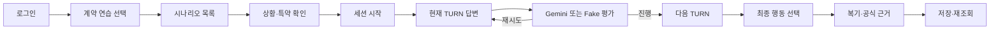

# 계약 연습 시뮬레이션 구현·검증 가이드

> 갱신: 2026-07-23. 현재 코드·fixture·테스트 기준. 과거 작업 순서와 완료 로그는 Git history를 사용한다.

## 현재 상태

- 승인된 합성 시나리오 3개가 AI 답변 평가, Backend 영속 API, Frontend 텍스트 대화·복기 화면에 연결됐다.
- 실제 계약 분석과 별도 `practice_session_id`·`practice_turn_id`를 사용한다.
- Gemini key가 있으면 Gemini practice provider, key 없이 `PRACTICE_OFFLINE_MODE=true`이면 승인 answer key 기반 Fake provider를 사용한다.
- 실제 Gemini 네트워크 응답 품질·비용은 미검증이다.
- 아바타·영상·TTS·STT는 구현 범위 밖이다.

제품 경계는 [`../decisions/2026-07-20-practice-simulation-boundary.md`](../decisions/2026-07-20-practice-simulation-boundary.md), 사용자 규칙은 [`practice-simulation-product-rules.md`](practice-simulation-product-rules.md)를 따른다.

## 사용자 흐름



## 시나리오

| ID | 상황 | 연결 |
|---|---|---|
| `PRACTICE-DEFERRED-REFUND-001` | 후임 임차인 입주 후 보증금 반환 | R08, J10, DP08 |
| `PRACTICE-THIRD-PARTY-PAYMENT-001` | 임대인·소유자와 다른 계좌로 송금 요구 | R06, J05, DP02 |
| `PRACTICE-PROXY-AUTHORITY-001` | 대리 권한 자료 없이 서명·송금 요구 | J01, J04 |

R04는 압류·가압류 규칙이다. 대리권 시나리오에 연결하지 않는다.

초기 승인 fixture `PRACTICE-BROKER-PRESSURE-001`은 schema·평가 호환 검증용이다. 현재 사용자 목록은 위 3개 시나리오를 제공한다.

## 책임 경계

### AI

- 승인된 `scenario.json`·`answer-key.json`을 로드한다.
- Python 규칙 엔진만 R/J 상태와 `urgency`를 결정한다.
- Gemini는 현재 사용자 답변의 의미를 분류한다.
- 상태 머신이 provider 제안을 검증하고 최종 전이를 결정한다.
- provider 실패·timeout·형식 오류는 사용자 오답으로 처리하지 않고 `needs_review`로 유지한다.

### Backend

- 연습 데이터는 실제 계약·분석 테이블과 분리한다.
- 세션·턴·평가·최종 결과를 사용자별로 저장한다.
- 인증·소유권·request ID 중복 방지·완료 후 불변을 보장한다.
- 정답표·숨은 신호·미래 TURN을 API에 노출하지 않는다.

### Frontend

- `/practice` 목록·소개·세션·결과 화면을 제공한다.
- 현재 TURN만 표시한다.
- loading·submitting·needs_review·network_error·completed 상태를 구분한다.
- 새로고침 후 진행 세션 또는 완료 결과를 복원한다.
- 모바일 1열과 키보드 접근성을 유지한다.

## 답변 평가와 상태 전이

답변 분류:

```text
appropriate_check
partial_check
ambiguous_answer
avoidance
no_response
needs_review
```

진행 규칙:

- `appropriate_check`: 다음 상태만 허용
- `avoidance`, `no_response`, `needs_review`: 현재 TURN 재시도만 허용
- `partial_check`, `ambiguous_answer`: 답변 의미에 따라 진행 또는 재시도 허용
- provider가 허용되지 않은 상태를 반환하면 `needs_review`로 바꾼다.
- 목표 문장을 그대로 복사하지 않아도 필요한 확인 행동이 의미상 포함되면 진행할 수 있다.

## Provider 선택

```text
GEMINI_API_KEY 또는 GOOGLE_API_KEY 있음
→ GeminiPracticeProvider

key 없음 + PRACTICE_OFFLINE_MODE=true
→ FakePracticeProvider

그 외
→ provider 없음 → needs_review
```

현재 Gemini model ID는 코드의 `GeminiPracticeProvider.model_name`을 단일 실행 기준으로 확인한다. 문서에 별도 모델 상수를 복제하지 않는다.

Gemini에 전달하는 정보:

- 현재 시나리오·TURN
- 현재 사용자 답변
- 누적 확인 행동
- 읽기 전용 R/J 문맥
- 허용된 다음 상태
- 고정 Structured Output schema

Gemini가 하지 않는 것:

- 계약 사실·정답 생성
- R/J 판정 변경
- 안전·위험·사기 결론
- 임의 공식 근거 생성
- 허용되지 않은 상태 전이

## 주요 파일

```text
data/sample/practice/                         승인 시나리오·answer key
ai/src/lease_companion_ai/schemas/simulation.py
                                                canonical 시뮬레이션 schema
ai/src/lease_companion_ai/simulation/          평가 서비스·상태 머신
ai/src/lease_companion_ai/providers/gemini_practice.py
                                                Gemini/Fake provider·factory
backend/app/models/practice.py                 영속 모델
backend/app/services/practice.py               세션·턴·결과 서비스
backend/app/api/routes/practice.py             Practice API
frontend/src/services/practice.ts              API client
frontend/src/pages/practice/                   목록·소개·세션·결과 화면
frontend/e2e/practice-flow.spec.ts             브라우저 전체 흐름
docs/testing/practice-real-api-validation.md   실제 API 실행 절차
```

현재 endpoint와 응답 계약은 [`../api/openapi.json`](../api/openapi.json)을 단일 기준으로 사용한다.

## 오프라인 수동 검증

Docker Desktop을 켠 뒤 저장소 루트에서 실행한다.

```powershell
Set-Location C:\Lease-Companion
pwsh -File .\scripts\start-dev.ps1 -PracticeValidation
```

이 모드는 다음을 강제한다.

- Gemini key 비활성화
- `PRACTICE_OFFLINE_MODE=true`
- Frontend MSW 비활성화
- PostgreSQL·FastAPI·Vite 사용
- Fake provider 사용

실제 Gemini 검증에는 `-PracticeValidation`을 사용하지 않는다.

## 자동 검증

저장소 루트:

```powershell
python -m pytest ai/tests/simulation ai/tests/providers/test_gemini_practice.py -q
python -m pytest backend/tests/api/test_practice.py -q
```

Frontend:

```powershell
Set-Location C:\Lease-Companion\frontend
npm test -- --run
npm run build
npm run test:e2e:practice
npm run test:e2e:practice:real
```

`test:e2e:practice`는 MSW 경로, `test:e2e:practice:real`은 실행 중인 실제 FastAPI·PostgreSQL 경로다.

검증 범위:

- 시나리오 3개 노출
- 미응답 재시도
- 3개 TURN 진행
- 부분 답변 진행 정책
- provider 실패 시 현재 TURN 유지
- request ID 중복 방지
- 새로고침 세션 복원
- 최종 행동·복기 저장
- 다른 사용자 접근 차단
- 정답표·숨은 신호·미래 TURN 비노출
- 모바일 320×720·360×800, PC 1440×900

## 현재 제한

- 실제 Gemini 네트워크 응답 품질·지연·token·비용 미측정
- provider 공통 rate limiter·중앙 재시도 정책 미구현
- 텍스트 입력만 지원
- 미디어·음성·실시간 아바타 미구현
- 시나리오 카탈로그는 현재 3개 사용자 노출 범위
- 운영 배포·모니터링 정책 미정

## 문서 우선순위

1. 현재 코드·fixture·테스트
2. `docs/api/openapi.json`·generated schema
3. 이 가이드와 제품 규칙
4. ADR
5. 회의록·Git history

구현 상태가 달라지면 이 문서의 `현재 상태`, `Provider 선택`, `자동 검증`, `현재 제한`만 갱신한다. 작업별 완료 로그는 추가하지 않는다.
